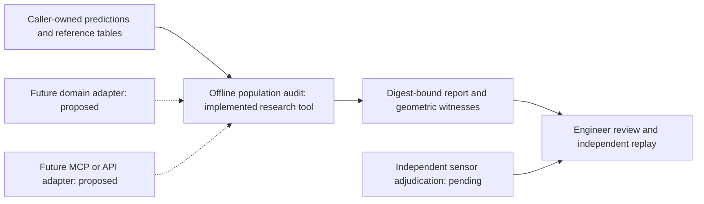

# Developer access must earn adoption

Document ID: `reiyah.developer-access-research.2026-09-07`

Version: `0.1.0`

Lifecycle status: `proposed`

The operator's idea is to make Reiyah freely accessible so engineers and engineering agents
can obtain substantial value on their own systems. That is a credible distribution hypothesis.
It is not evidence of demand, scientific differentiation, an acquisition outcome or a technical
moat. The next useful claim to test is narrower: Reiyah helps an outside engineer identify a
consequential evaluation error and reproduce a counterexample with less effort than their
existing workflow.

## What already exists in September 2026

FiftyOne documents a model-evaluation skill using its Enterprise product and MCP server:
natural-language evaluation, failure exploration, comparison and background computation are
already available. An MCP evaluation endpoint therefore supplies no differentiation by itself.
[Primary documentation](https://docs.voxel51.com/agents/skills_ecosystem/fiftyone-model-evaluation.html).

FiftyOne also exposes detection-mistake review, including likely missing and spurious
annotations and localization issues. Reiyah should not claim that annotation-error discovery
or visual review is new.
[Primary tutorial](https://docs.voxel51.com/tutorials/detection_mistakes.html).

Cleanlab's object-detection workflow ranks potential annotation problems using labels and
model predictions, and calls for out-of-sample predictions. Its problem includes missing,
misclassified and poorly localized boxes. This is relevant prior art, although its illustrated
2D task is not an interchangeable benchmark for Reiyah's current 3D population audit.
[Primary tutorial](https://docs.cleanlab.ai/stable/tutorials/object_detection.html).

The [source ledger](../evidence/developer-value/source-ledger-0.1.0.json) records privately
retained primary bytes, versions, retrieval times and redistribution boundaries. These sources
are advisory comparisons, not admitted support for a Reiyah performance claim. This review
has not run a head-to-head experiment against those products.

## A candidate value proposition

An evaluator can be numerically correct for one reference population while its result is
described as evidence about a different population. A useful Reiyah response would contain
the exact violated interpretation, the reference/selection path that creates it, a minimal
replayable counterexample, and the conclusion that remains supportable after correction.

That is more demanding than returning a metric or a suspicious example. It also requires
more evidence than a fluent explanation. Reiyah has one real instance in
[AO](RESULT_AO_REFERENCE_POPULATION_AUDIT.md), and now has a
[portable synthetic audit](REFERENCE_AUDIT_DEMO_2026-09-07.md). It has not established that
this capability repeatedly finds errors outside its own research program or beats a competent
engineer with the same data and evaluator source. Scientific novelty remains unestablished.

The lessons from [Sentinel, Telos and Inbar](SIBLING_RESEARCH_TRANSFER_2026-09-07.md) extend
the research question: can an evidence tool detect where reported success ceases to identify
the claimed property? They do not yet justify a universal cross-domain product or merged engine.

## The next adoption experiment

**Question.** Does Reiyah reduce the effort needed to find and correctly explain a consequential
reference-population error on an evaluation pipeline we did not design?

**Hypothesis.** Given the same prediction, reference and evaluator artifacts, an engineer using
Reiyah obtains a correctly scoped, independently reproducible counterexample more reliably
or with less review effort than with the strongest appropriate existing workflow.

**Minimum experiment.** Start with one independently selected external pipeline and one
qualified outside evaluator, using data they can lawfully inspect locally. Retain the unmodified
inputs and evaluator revision, a prospective task and timing definition, and an independently
judged disposition of each finding. Include a known-good control and a seeded population
exclusion whose construction is hidden from the person doing the audit. A seeded success
checks the instrument; a naturally occurring confirmed error is the first external value signal.
One case cannot estimate an industry-wide rate. Replicate on another pipeline before expanding
the interface or making a general adoption claim.

**Baselines.** The official evaluator plus an engineer's ordinary scripts, and a competent
FiftyOne-assisted workflow with the same source metadata. Include Cleanlab when the task
actually falls within its supported label-audit problem. Do not withhold a wider reference table
or filtering policy from the baseline while giving it to Reiyah. A straightforward, correctly
implemented reference comparison is mandatory; beating an uninformed metric viewer is weak.

**Ablations.** Metric-only output; witnesses without the population contract; contract without
the witness; and the full response. Keep input information, compute and review budgets matched.
The test is whether the contract and witness improve decisions, not whether extra prose is liked.

**Metrics.** Confirmed natural errors found, unsupported findings, unresolved findings,
time to a verified counterexample, independent replay completion and engineering effort to
correct the pipeline. Record initial setup separately from repeated use. Count the relevant
opportunities and missing outcomes. Prefer these to downloads, stars, model praise or an
uncontrolled demonstration's wall time.

**Failure criterion.** The finding is reproducible only with undisclosed extra data, disappears
under the correct baseline, lacks independent confirmation, or costs more review effort
without an offsetting validity advantage. Failure means simplify or stop this product hypothesis;
it does not invalidate AO's narrower correction.

**Success criterion.** An external evaluator confirms a consequential, naturally occurring
scope error, independently replays the witness and makes a justified correction. Repeat that
result with a different evaluator/pipeline before making a reusable-system claim. Quantitative
superiority requires a larger prospectively powered study; no effect size is asserted here.

**Second-order consequence.** If the evidence value repeats, build the smallest adapter that
fits the users' workflow. If only the seeded error is found, the result is conformance evidence,
not demonstrated external demand. If experts already obtain the same answer cheaply, prefer
integration with their existing tools over a separate platform.

This is a proposed user study, not a recruitment action. No external messages were sent and
no independent evaluator was invented. The prepared 240-case reference study remains the
highest-priority scientific dependency and has zero human judgments at this checkpoint.
An independently confirmed evaluator-scope error need not wait for those physical judgments:
it can be established from the evaluator and reference records themselves. If an independent
pipeline and evaluator become available, that bounded value experiment can proceed in parallel.
Claims about physical detector correctness still require adequate physical reference evidence.

## Interface architecture, including the actual 2026 protocol

The current July 28, 2026 MCP specification differs materially from older examples. It
removes connection-scoped initialization and sessions, adds per-request version/capability
metadata and `server/discover`, and moves tasks to an extension. A future adapter must pin a
supported revision and test actual clients, rather than copying an old server skeleton.
[Versioned changelog](https://modelcontextprotocol.io/specification/2026-07-28/changelog.md).

The current transport definition offers stdio and Streamable HTTP as bindings for the same
semantics. That supports starting with a local, inspectable tool when data should remain with
the engineer, then adding transport only when an integration needs it.
[Transport overview](https://modelcontextprotocol.io/specification/2026-07-28/basic/transports/index.md).

In the current HTTP binding, responses are a JSON object or a request-scoped SSE stream.
Stream resumability is removed; a broken request must be reissued. A future analysis service
therefore needs explicit job identities and idempotent request handling where execution has
cost, independent of transport-level request IDs. The protocol itself supplies no measured
latency advantage for Reiyah.
[Streamable HTTP specification](https://modelcontextprotocol.io/specification/2026-07-28/basic/transports/streamable-http.md).

An eventual MCP tool should return the same versioned evidence artifact as the CLI, with
small structured findings and separately addressable larger artifacts. The adapter must not
change the scientific calculation, turn an unknown into a boolean verdict, or give a model
unrestricted file/network execution. High-volume sensor payloads belong in an explicit data
interface under the owner's access controls, not repeatedly embedded in a conversation.
No control-loop or real-time driving integration is warranted.

The work implemented now is deliberately smaller: a deterministic offline auditor and
counterexample fixture. A hosted service, accounts, telemetry collection, autonomous scientific
judge, general-purpose hypothesis marketplace, new perception model and cross-repository
runtime are deferred. None would supply the independent evidence presently missing.

## The decision

Offer a capability once it earns repeated use, then make access easy. Open distribution can
reduce adoption friction and improve scrutiny. Defensibility would have to come from useful
reference adapters, an independently confirmed failure corpus, better evaluation methods and
integration into decisions that matter. The transport wrapper and a large codebase are not
that moat. Reiyah has begun the required work, but has not yet earned a frontier or
category-defining verdict.
