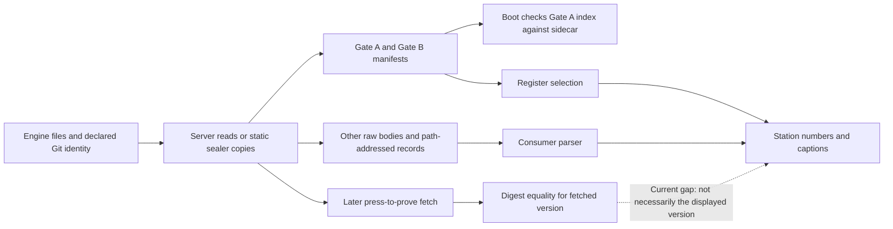

# What the evidence interfaces actually establish

Document ID: `reiyah.interface-evidence-review.2026-09-07`

Version: `0.1.0`

Lifecycle status: `exploratory`

The console's evidence design is useful, but its claim that rendered records have already
been digest-verified is stronger than the captured implementation. An isolated execution
of its actual consumer functions accepted an altered coefficient and an invalid report
body while the index check passed. Two stations selected the oldest available claim
register. A missing comparison became a numerical zero. These are interface defects;
they neither invalidate the underlying retained experiments nor establish that anyone
tampered with the live service.

## Sources and scope

The read-only review captured all 24 tracked files of `reiyah-measure` at
`54fb7520e8cb1cf9aef8f3678192193e4440a50e`, and 213 selected source/snapshot files from
`reiyah-console` at `b316d4bf618cc0e6fbf3b485a23fe94d876623d2`. The console had uncommitted
snapshot updates: its captured Gate B manifest names engine commit
`9464ff79a823a91037604bb8343e984b29c128a5`. Those working bytes are distinguished from the
console commit. The source capture does not claim an exhaustive audit of its 676 tracked
files, browser behavior, devices, deployment or external users.

The [source probe](../tools/measure/probe_console_evidence.mjs) compiles the captured
TypeScript and invokes its loaders, parsers, boot verifier and proof function with mocked
HTTP responses. Station functions produce elements and stat properties under small React
stubs; React scheduling, effects, canvas drawing and the DOM are not executed. Thirty-three
source/payload files are bound in each probe result. This is stronger than a text search,
and narrower than a browser integration test. The
[original result](../evidence/interface-evidence/original-probes-0.1.0.json) preserves both
the failures and positive controls. Private source custody and owner readbacks remain
outside Git; no sibling code or data acquires Reiyah authority.

## Reconstructed flows

The historical measurement companion implements public-prediction retrieval, a selected
annotation cache, greedy class/range matching, and lettered statistical scripts. It has
no general measurement API or MCP server in the captured tree. Its A-H transcripts and
README retain an earlier scientific interpretation. The newer Reiyah research branch
contains later corrections; the repositories are not interchangeable current releases.

The console is a React/Vite research presentation. Its read-only HTTP/SSE server reads
files from the engine worktree. Its sealer copies file bytes into a static snapshot and
records digests plus Git identity. The browser first tries the server, then the snapshot.
Gate A and Gate B have separate manifests. Gate B transcripts are turned into numerical
objects by handwritten regular expressions, then into station charts and captions.
The claim register is loaded alongside those numbers, and a separate user action can
recompute a source digest. The animated Harbor field consumes artifact metadata; it is
an illustrative processing diagram, not a learned physical-world simulation. The Encounter
identifies its synthetic fixture. Neither is empirical evidence of a perception or belief
estimator.

## Reproduced failures

The identifiers below bind to the probe output. A successful probe means the stated
behavior was reproduced; it is not a passing application validation.

| ID | Executed observation | Consequence | Private repair |
|---|---|---|---|
| F01 | `fetchLaneText` accepts a changed Result L body with the old declared digest; the Measurement headline contains synthetic replacement 9.999 | A source digest displayed beside a figure need not describe the parsed bytes | Rejected before parsing |
| F02 | `verifyEvidenceOnce` returns an invalid replacement report after a correct index/sidecar comparison | Boot integrity applies to the index; it does not extend automatically to the report | Remains reproduced |
| F03 | `fetchSurfaceByPath` returns an uncatalogued mocked record as observed and hashes that record itself | Computing a digest is not checking an expected digest or membership | Remains reproduced; client API test only |
| F04 | Cached Result L still parses to 1.151 while a later version parses to 1.159; `prove` returns equality for that later version | A later valid pair of bytes/digest does not prove the earlier displayed artifact | Remains reproduced |
| F05 | Measurement and SameHazard select register 0.1.0 with 9 claims while 0.2.23 with 47 claims is available | Those views omit 38 successor entries, despite comments saying selection is dynamic | Both select the available successor |
| F06 | With Result Z present and AA absent, the Monitor subtitle says `AUC ∅, context adds 0.000` | An unavailable comparison is represented as a measured zero effect | Comparison remains unknown |
| F07 | A malformed coefficient becomes NaN; removal of L5 leaves L4 as the terminal row; empty H4 gives zero trials/participants | A regular-expression match is not complete numerical or epistemic validation | These three cases reject |

The nine claims common to the two registers retain the same inspected status, current-use
and estimand fields. F05 is therefore an omitted-successor problem; this review did not
find those nine statuses rewritten incorrectly. Monitor and Law already use the successor
resolver and serve as positive controls. Unchanged Result L produces six rows with terminal
coefficient 1.151, and an altered Gate A index is correctly rejected.

F04 deliberately uses a replacement inside the original numerical interval. This isolates
version binding from parser validation. The first repair probe used 9.999 for this separate
case and correctly hit the new interval check; that failed probe is retained privately.
The subsequent test changes the fixture, not the rejection requirement.

## What is already implemented well

The captured interface has explicit unavailable states, source paths, claim-status displays,
separate lane identities, a real index digest check and synthetic-fixture labels. It exposes
counterevidence and includes baseline comparisons. Its source annotations repeatedly
distinguish association from causation and preserve operator nonacceptance. Those concrete
choices are worth preserving. They do not justify describing every render as verified.

The private four-file repair changes `gateb.ts`, Measurement, SameHazard and Monitor. It
checks Gate B digest syntax, byte length and SHA-256 before strict UTF-8 decoding; connects
the two register consumers; rejects the tested malformed/incomplete convergence and missing
H4 header; and preserves unavailable differences. The
[repair probes](../evidence/interface-evidence/repair-probes-0.1.0.json) pass for these cases.
A supplied equal-AUC comparison still gives zero, while one missing comparator remains
unknown. Four invalid digest/length bindings reject. TypeScript `--noEmit` also passes
over the private copy with the locally installed dependencies. This is not a hermetic build,
UI layout check or deployment test. F02-F04 remain explicitly outside this repair.

## The historical companion needs a clear succession notice

A small control reruns the companion matcher on an empty synthetic table with a deliberately
wrong mAP target of 50. It prints a validation failure, exits zero and writes its output.
The already-corrected matcher in the research lineage exits nonzero and writes no output
on the same control. The [paired result](../evidence/interface-evidence/companion-control-0.1.0.json)
demonstrates an old defect surviving in a historical repository, not a newly discovered
empirical failure. No historical source or transcript was changed.

The companion's Result G still translates a descriptive coefficient into validation counts.
Its H script compares a small selected set of published architectures and attributes a
pair difference to modality. The board's existing objections remain: benchmark errors are
not safety-critical failure events, matched aggregate mAP does not control the causes of
joint failure, detector pairs share components, and a weighted conditional coefficient is
not a uniform safety bound. Do not make this earlier README the entrance to a current SaaS
offering or revive its exclusivity claims. Preserve it as history with explicit successors.

## The required interface change

The engineering unit should be one immutable measurement and interpretation bundle. It
must bind source bytes, parser/schema version, estimand, opportunity population, numerical
result, uncertainty type and current claim interpretation. The display and its receipt must
refer to that same bundle. Hashing an index, copying a file, checking a program and auditing
the physical reference are separate propositions.

The [consumer design](MEASUREMENT_CONSUMER_DESIGN_2026-09-07.md) specifies the next bounded
change and its adversarial acceptance conditions. It is an interface investigation, not a
new product gate, certificate or reason to delay the independent physical-reference study.
