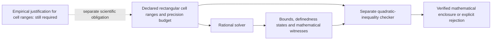

# M4 bound audit: a finite supremum was reported as unbounded

Document ID: `reiyah.m4-rectangular-bound-findings.2026-09-07`

Version: `0.1.0`

Lifecycle status: `corrected`

The retained synthetic M4 fixture F-03 reports an unbounded coincidence coefficient.
On its declared rectangular cell domain, its supremum is **199/4 = 49.75**, finite and
not attained. The coefficient remains undefined at some feasible positive-universe points.
Undefinedness and unboundedness were incorrectly conflated by the historical routine.

An independent authored example also shows that the historical grid can miss a feasible
maximum. Calling a grid result an identification outer bound is unjustified without an
enclosure argument. The original M4 source, transcript and register remain unchanged as
historical records; this correction is a new, separately retained investigation. It changes
no measured camera/lidar coefficient, reference-study selection or physical judgment.

## What was executed

The [audit](../tools/measure/audit_m4_bounds.py) extracts the literal cell and budget
assignments and all seven direct `report` calls from the retained M4 source AST. It runs
the historical `budget_box` and `optimise` functions without assigning their globals.
It does not execute historical `main`, the random probes or `optimise_differential`.
The [completed output](../evidence/m4-bounds/audit-0.1.0.json) binds the exact source and
transcript digests. Its [process capture](../evidence/m4-bounds/audit-capture-0.1.0.json)
records an observed successful exit and retained stdout/stderr digests.

For the three tied historical calls, the corrected rectangular minimum and maximum have
witnesses that also satisfy the retained tie. Thus the rectangular extrema establish the
same extrema for those particular tied subsets. This is not a general theorem that tying
arbitrary single-miss perturbations never changes a bound.

<!-- M4_HISTORICAL_TABLE_BEGIN -->
| Retained fixture | Old displayed classification | Corrected infimum | Corrected supremum |
| --- | --- | ---: | ---: |
| F-01 zero budgets | [1.0000, 1.0000] | 1.000000 | 1.000000 |
| F-01 L1 rectangle | [0.0000, 2.0000] | 0.000000 | 2.000000 |
| F-01 L2 tied subset | [0.0000, 2.0000] | 0.000000 | 2.000000 |
| F-01 L3 tied subset | [0.8669, 1.1459] | 0.866877 | 1.145872 |
| F-01b L1 asymmetric | [0.8790, 1.2464] | 0.879012 | 1.246361 |
| F-01b L2 tied subset | [0.8790, 1.2464] | 0.879012 | 1.246361 |
| F-03 thin stratum | UNBOUNDED | 0.000000 | 49.750000 (unattained) |
<!-- M4_HISTORICAL_TABLE_END -->

Decimals are displayed to six places; exact rational values and witnesses are retained in the output.

The six finite historical results agree with the new extrema to floating-point precision.
F-03's incorrect infinity classification is reproduced by the unmodified historical routine.
The newly authored off-grid example is a separate solver counterexample; it is not evidence
that every historical finite endpoint was numerically wrong.

## Why F-03 is finite

The retained fixture starts from (a,b,c,d) = (2,3,40,955), with mechanism budgets
(10,10,5,5). Its implemented `budget_box` gives:

```text
a in [0,22], b in [0,23], c in [20,60], d in [935,975].
```

For fixed a, C = a(a+b+c+d)/[(a+b)(a+c)] decreases with b and c and increases with d.
On the maximizing face b=0, c=20, d=975 and for a>0:

```text
C(a,0,20,975) = 1 + 975/(a+20).
lim as a -> 0+ C = 1 + 975/20 = 199/4.
```

Every defined point is below that supremum. The sequence a=22/k with positive integer k
approaches it inside the box. At a=0,b=0 the A marginal is zero and C is undefined.
The minimum 0 is attained, for example at (0,23,60,935). The defined coefficient range is
[0,49.75), whose closed outer enclosure is [0,49.75]; undefined feasible points are reported
separately. This is still a very wide fixture result, not evidence of useful identification.

## Why the grid cannot supply an outer bound

For a in [0,11] and b=c=d=1, the derivative changes sign at a=3. The true maximum is 9/8.
The retained 21-point axis samples a=2.75 and a=3.3 around that point. Its largest sampled
coefficient is 253/225, below the true maximum by 1/1800. Increasing the grid density or
finding no violation in random probes cannot, by itself, make an interval an outer bound.


The [standalone PNG](figures/m4-rectangular-bounds.png) and
[plot source](../tools/measure/plot_m4_bounds.py) use only the retained synthetic audit.
The left panel is explicitly zoomed near the maximum. The right panel shows F-03's maximizing
face; the open marker denotes an undefined endpoint with a finite one-sided limit.

## Implemented mathematical component

The [specification](M4_RECTANGULAR_BOUND_SPECIFICATION_2026-09-07.md) derives the complete
nonnegative rectangular case split. The
[solver](../tools/measure/rectangular_coincidence_bounds.py) reduces four dimensions to
one through monotonicity, solves rational stationary points exactly, and encloses irrational
ones with rational bisection. It reports actual precision and explicit attainment witnesses.
Its input is a bounded, versioned JSON task with exact numeric strings and an
[input schema](../research/m4-rectangular/0.1.0/input.schema.json).

The [separate checker](../tools/measure/check_rectangular_bounds.py) imports neither the
solver nor its helpers. To check a lower claim L and upper claim U, it verifies nonnegativity
of these quadratics throughout a's complete interval, using endpoints and any interior
convex vertex with exact rational arithmetic:

```text
Lower face: (1-L)a^2 + [(b_U+c_U)(1-L)+d_L]a - L b_U c_U >= 0
Upper face: (U-1)a^2 + [(b_L+c_L)(U-1)-d_U]a + U b_L c_L >= 0.
```

It additionally checks feasible extremum witnesses, stationary-root signs, finite boundary
limits, divergent sequences, the input digest and precision claims. The check is algorithmically
separate; both implementations were written in the same research session. This is not
independent human review, a proof-assistant kernel or an empirical-reference certificate.
The checker expressly does not authenticate the producer's source digest. Source integrity
is checked separately by the development verification; algebraic validity and provenance
must not be confused.



## Controls and practical use

All 21 [regression tests](../tools/measure/test_rectangular_bounds.py) pass. They include
1,296 finite lattice rectangles, channel exchange, proportional scaling, an irrational
maximum, genuine divergence, finite undefined limits, empty and entirely undefined domains,
and exhausted precision budgets. Adversarial controls reject forged lower/upper bounds,
wrong stationary polynomials, false infinity, false precision, Boolean coercion and numeric
literals that could request unbounded exponent expansion. The actual CLI and checker are
also exercised, including a tampered report. A finite lattice is a control, not the proof
of the continuous-domain result; that argument is in the specification and inequalities.

From the research checkout, these offline commands reproduce the small example:

```sh
reiyah_m4_report=$(mktemp /tmp/reiyah-m4-example.XXXXXX)
python3 -B tools/measure/rectangular_coincidence_bounds.py research/m4-rectangular/0.1.0/example.json > "$reiyah_m4_report"
python3 -B tools/measure/check_rectangular_bounds.py research/m4-rectangular/0.1.0/example.json "$reiyah_m4_report"
python3 -B tools/measure/audit_m4_bounds.py
python3 -B -m unittest discover -s tools/measure -p test_rectangular_bounds.py -v
```

Use a new output path when retaining a new experiment. The solver and algebra checker require
only the Python standard library; plotting is optional. No dataset, model, API key, service
or new cloud resource is needed for this mathematical example.

## What remains scientifically open

The mathematics identifies extrema of a supplied rectangle. Mechanism budgets may define a
coupled feasible set; replacing that set with coordinatewise ranges can widen it. Sharp
rectangular extrema do not establish sharp bounds for the coupled model. This implementation
must not silently replace M4's differential solver or be described as validating its constraints.
No sampling-confidence region is constructed, and no method of combining identification
and sampling uncertainty is established here.

The [preceding reference-noise correction](REFERENCE_NOISE_INTERPRETATION_2026-09-07.md)
also remains necessary. Proportional cell rescaling is not general uniform reference corruption.
The next substantive identification problem is specifying and constraining the reference
transition and opportunity-selection processes from observations independent of the evaluated
channels. The frozen 240-case prediction study answers a narrower question and cannot by itself
count opportunities missed by every detector and the reference. Adding service access would
not resolve that missing information.

This component is elementary analysis implemented with explicit evidence checks. No scientific
novelty, 2026 frontier ranking, certification or commercial acceptance is claimed for it.
