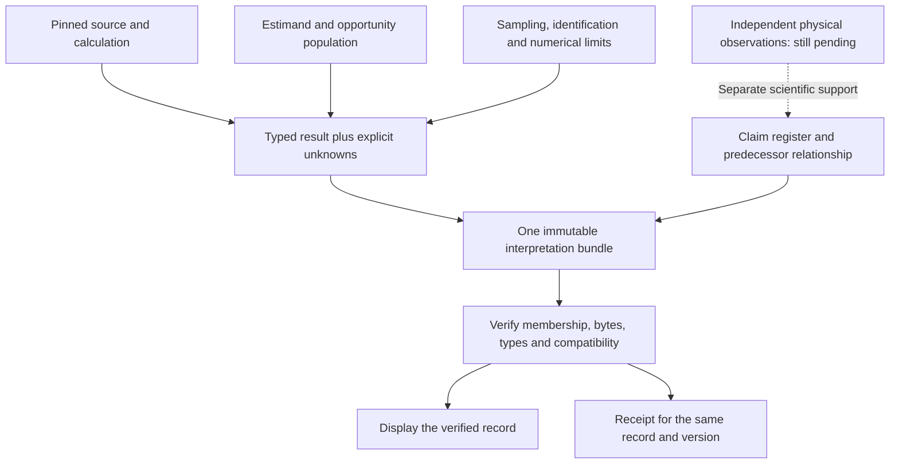

# One measurement, one exact interpretation

Document ID: `reiyah.measurement-consumer-design.2026-09-07`

Version: `0.1.0`

Lifecycle status: `proposed`

The next interface change should make it impossible to prove one artifact while displaying
another. The [source review](INTERFACE_EVIDENCE_REVIEW_2026-09-07.md) supplies concrete
counterexamples. This design does not authorize a server, deployment, operator decision or
new scientific claim. It is a bounded proposal for the owning engine and console sessions.

## The unit the consumer needs

For a displayed quantity, retain an immutable tuple

\[
 D=(r, s, h_b, h_p, h_e, h_o, h_u, h_c, v),
\]

where `r` identifies the source repository, `s` the exact snapshot, `h_b` the measured
input/result bytes, `h_p` the parser or typed-schema specification, `h_e` the estimand,
`h_o` the opportunity-population specification, `h_u` the uncertainty calculation,
`h_c` the claim interpretation and `v` the resulting display value with epistemic state.
These are explicit bindings, not suggestions to compute another decorative hash. A byte
digest is a content identifier; its authority still depends on the provenance and policy
that admitted it.

A frozen snapshot can legitimately display its historical claim register, provided it says
which snapshot and interpretation it displays. A current view must atomically select its
new interpretation and retain its predecessor. Sorting filenames alone does not verify a
predecessor chain, compatibility, completeness, or absence of a later withdrawal.

The value and its receipt should be derived from the same retained byte buffer. If the
receipt refetches bytes, it must compare them with the digest bound to that displayed value,
not merely with a second newly fetched manifest. Late results from a closed or superseded
receipt request must not overwrite a newer request. Memoization must be keyed by repository,
snapshot and content digest; a raw path or loader-source string does not identify a version.

## Keep verification claims separate

| Proposition | What could support it | What does not support it |
|---|---|---|
| These bytes match the requested artifact | Expected digest and length checked before parse, under a declared root/snapshot policy | Hashing whatever arrived |
| These inputs belong to one interpretation | Bound manifest, register, estimand and parser identities checked together | Independent successful fetches |
| This number follows from these records | Typed validation, retained calculation and appropriate independent recomputation | A valid signature on the number |
| This reference supports a physical conclusion | Independent observations and a declared identification argument | A reproducible annotation-relative coefficient |
| An authorized operator accepted the exact artifact | The repository's existing acceptance mechanism | A browser check, signer name, consensus or tool success |

Sampling uncertainty, reference-identification uncertainty and numerical approximation must
remain separate. A confidence interval from resampled scenes is not an identification bound.
An unavailable comparison stays unavailable; a measured zero stays zero. Corrected and
withdrawn interpretations stay discoverable without continuing to serve as current support.

## Minimum implementation sequence

First apply the narrow, privately prepared consumer repairs after the owning session reviews
their exact base. They close observed defects without changing the engine's scientific
results. They do not complete the bundle contract.

Next, implement one vertical slice using Result L and its claim interpretation. Emit a
versioned typed result from its calculation, preserving the existing transcript as history.
Bind the result, population, interval method and interpretation in one snapshot. Make both
the numeric panel and its receipt consume that exact record. Reject incomplete or mismatched
records before rendering a numerical value. Only after that slice works should other
stations migrate. Do not rewrite every historical script or issue new safety certificates.

For the remaining Gate A path-addressed records, the sealer must provide expected digests
and lengths in a manifest the consumer actually checks. An old catalog containing only
paths and sizes cannot silently gain verification status. Plan the catalog/version migration
explicitly, retain old snapshots and distinguish unavailable verification from corrupted
data. Read immutable Git objects or an immutable projection when binding a commit; a prior
clean-worktree observation followed by filesystem copying does not itself prove all copied
bytes came from that commit.

## Discriminating acceptance experiment

Freeze two valid snapshots with different coefficients and an explicit interpretation
correction. In a controlled response adapter, independently reorder, delay, omit and replace
the result, register, report and receipt responses. Include a valid historical view, a
corrupted body, a correctly hashed but incompatible result, a missing comparison, a real
zero difference and a late response to an older receipt. The baseline is the captured
consumer; the comparator is the new single-slice consumer under identical responses.

The main metric is incorrect numerical or authority presentation, by failure class. Count
explicitly blocked/unavailable presentations separately from wrong ones, and preserve
every injected case. Success requires rejection or explicit historical/unavailable labeling
in every declared incompatible case, unchanged values in valid cases, and a receipt bound
to the exact displayed record under reordering. A merely higher rejection rate is not enough.
Also measure refresh latency and bytes fetched, but do not trade correctness for a faster
unverified headline. Then test the same slice in the real browser and with independent
readers; this source probe does not supply either result.

## Engineering prior art and the 2026 comparison

[TUF specification 1.0.36, modified 5 August 2026](https://theupdateframework.github.io/specification/v1.0.36/)
already separates root trust, target hashes/lengths, coherent snapshots and freshness. Its
client workflow withholds target files until checks pass, and its threat model includes
mixed versions and rollback. This is prior art for artifact distribution, not scientific
measurement. Reiyah should use that distinction; it should not claim novelty for a digest
or infer physical validity from an authenticated download.

[SLSA 1.2's attestation model](https://slsa.dev/spec/v1.2/attestation-model) separates the
artifact, authenticated envelope, subject-binding statement and typed predicate. A signature
identifies the attester; the predicate states the claim. That is relevant to Reiyah's proposed
receipts, but it neither validates their science nor establishes an authorized acceptance.
The exact page bytes are retained; the page's publication date was not established in this
review, so no dated standards-conformance claim is made.

The [source ledger](../evidence/interface-evidence/external-sources-0.1.0.json) records
versions, retrievals, private byte custody and redistribution limits. No TUF implementation,
signing service or SLSA compliance program is added. The scientific priority remains the
independent reference observations specified by the research program.
