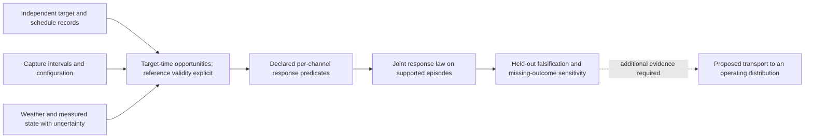

# A physical reference beyond object annotations

Document ID: `reiyah.physical-reference-options.2026-09-07`

Version: `0.1.0`

Lifecycle status: `proposed`

This assessment follows the [identification counterexamples](REFERENCE_IDENTIFICATION_FINDINGS_2026-09-07.md)
and the [rare-event feasibility result](RSS_TRANSFER_AND_RARE_EVENT_LIMITS_2026-09-07.md).
It asks where new observations could change what is identifiable. It does not start a
new dataset collection, alter the frozen 240-case study, or declare a new reference
independently valid.

## 1. The current research lead and its custody limit

[Smith et al., Sensors 2026, 26(17), 5649](https://www.mdpi.com/1424-8220/26/17/5649)
was published on **5 September 2026**. The NPL/Met Office study reports surveyed static
targets, simultaneous sensor and weather acquisition, and millisecond clock
synchronization. Its examples also expose delayed recovery after weather events and
ambiguity between atmospheric effects and wet surfaces. The measurement period spans
January 2022 to March 2024. These reported observations motivate a physical-reference
and sensor-state investigation; they are not Reiyah measurements.

The publisher-index text was inspected and retained as a tool extraction. Direct
publisher HTTP retrieval returned 403. Original publisher payload custody is therefore
**not established**. This distinction is explicit in the
[source ledger](../evidence/physical-reference-transfer/source-ledger-0.1.0.json).

The examples use sensor-specific targets/metrics, and some flat-weather and fog
comparisons use different dates. The article also notes target changes and missing
sensor days. Consequently its plots cannot be combined into a same-object joint-error
table. Whether the underlying records can support that table remains an open data
question, not a result inferred from the paper.

The older [NPL/Met Office proof-of-concept report](https://www.npl.co.uk/getattachment/d54755cf-8b36-4720-b433-a76f78216171/Proof-of-concept-report.pdf?lang=en-GB),
November 2020, revision 1.1 in May 2021, **is retained as original PDF bytes**. It
separates sensing-element characterization from higher-level perception performance,
uses weather-related range degradation as an exemplar, and treats uncertainty across
test environments as part of the measurement problem. Detailed AI-system testing is
outside its declared scope. This distinction prevents Reiyah from interpreting a
sensor-quality proxy as an object-detection or safety result. The report restricts
copying to personal noncommercial use; its payload stays private and supplies no
permission for a commercial dataset or hosted demo.

## 2. What the data-access preflight actually established

The public [SAF portal](https://saf.npl.co.uk/) returned its HTML application shell.
The script linked by that shell was fetched without authentication and inspected as
a public client artifact. It contains login, approval and application-specific terms
checks, and its data client obtains a bearer token. This establishes the presented
access workflow; it does not verify the server's enforcement. No protected data API
was called, no account was created, no terms were accepted and no person was contacted.

The recorded preflight is
[`physical-reference-preflight-0.1.0.json`](../evidence/physical-reference-transfer/physical-reference-preflight-0.1.0.json).
Its outcome is **candidate source; access and suitability unresolved**. There is no
new sensor dataset in this checkpoint. A failed 2024 report URL is retained as failed,
not counted as a read source.

Before selecting any records for a study, establish the following from original data
documentation and metadata, with explicit unknown states:

| Requirement | What would answer it | Why it changes the experiment |
| --- | --- | --- |
| Common opportunity | Target identity and surveyed footprint valid for every included channel at the same time | Co-degradation of separate calibration targets is a different estimand from a shared-target miss |
| Independent target reference | Survey method, uncertainty, installation/change history and independent target-presence record | A one-time survey alone does not establish later target presence, deformation or movement |
| Timing | Actual capture times, exposure/scan intervals, clock uncertainty and any aggregation | A clock's precision does not make different acquisitions simultaneous |
| Response definition | Raw responses or task outputs with a frozen, task-relevant pass/fail predicate | Reflectivity, point count and optical resolution are not interchangeable failures |
| Complete scheduled population | Target-time schedule and outage/servicing ledger independent of successful returns | Selecting only successful measurements can remove the failures of interest |
| Environment and state | Weather uncertainty, light, geometry, sensor settings, maintenance and any measured surface state | A weather tag may omit variables that determine the response |
| Usable distribution | Coverage of complete weather episodes and proposed operating conditions | Stress data require a supported path to the target probability law |
| Rights | Exact data terms, permitted processing, retention and redistribution | Paper access is not a license to a separate data service |

## 3. The high-information investigation this could enable

**QUESTION.** Is current measured weather and geometry sufficient to predict a declared
joint sensor-response law, or does observable history reveal additional state that
breaks that interpretation?

**HYPOTHESIS.** On independently referenced target-time opportunities, a model using
current weather \(W_t\), geometry \(G_t\), lighting and fixed sensor configuration can
predict the four response categories on withheld weather episodes. A competing model
uses the same inputs plus past weather/maintenance history \(H_t\). The null is
conditional response invariance to that additional history, within declared support:

\[
P(E_A,E_B\mid W_t,G_t,\text{light},H_t)
=P(E_A,E_B\mid W_t,G_t,\text{light}).
\]

This is a predictive sufficiency hypothesis. Rejecting it does not identify wetting
as the cause. A latent mechanical state, unmeasured lighting, changed targets or
seasonal drift could also produce the difference.

**WHY NOW.** The [passive sampling limit](RSS_TRANSFER_AND_RARE_EVENT_LIMITS_2026-09-07.md)
means useful risk extrapolation must earn its structural assumptions. This experiment
can cheaply falsify one candidate assumption at observable response rates before
anyone extrapolates to very rare joint failures. It complements, rather than answers,
the prepared annotation-reference study.

**MINIMUM EXPERIMENT.** First inspect target, timing, scheduling and access metadata
without fitting to response values. If a common target-time population cannot be
established, stop the same-opportunity study. A distinct co-degradation study could
be proposed, with its own estimand and limits. Do not relabel it as a miss study.

If the preflight succeeds, freeze a new protocol before response analysis: one
declared channel pair, one target family, a physics-relevant binary predicate per
channel, explicit measurement tolerance, unknown handling and whole-episode splits.
Choose predicates from a declared task requirement and reference uncertainty, not
from thresholds that maximize a coefficient. Different continuous metrics alone
do not supply that requirement. All planned target-times, including outages, enter
the opportunity ledger; estimates on jointly observable rows carry an explicit
selection limit and missing-outcome sensitivity.

Hold out complete weather episodes and a later time block. Keep every target and
every overlapping temporal window from one episode in the same split. Choose
history windows using development episodes only; future measurements cannot enter
a claimed prospective prediction. Report reference/timing adequacy before reporting
response-model quality. The feasibility census must determine whether enough
independent episodes exist for a powered protocol; no invented sample count is
preregistered here.

**BASELINES.** Use an unconditional empirical four-cell law, a transparent model of
current inputs, and a flexible model with those same inputs and comparable tuning
effort. Compare with an otherwise matched history model. Include per-channel models
whose predicted marginals are multiplied as an explicitly assumed-independence
baseline. No baseline may receive less valid reference information than Reiyah.

**ABLATIONS AND CONTROLS.** Remove history; replace it with same-complexity calendar
features; separate maintenance/target-version periods; vary only declared tolerances;
retain missing outcomes as unknown. Use a blocked history-shuffle negative control
whose construction respects the episode split and is declared before testing.
Compare continuous responses before relying on their thresholded versions. Examine
matched current-input regions before interpreting an out-of-support history effect.
These controls diagnose alternatives; they do not make an observational effect causal.

**METRICS.** Use held-out four-category log loss and Brier score, absolute joint-event
calibration, coverage/sharpness of declared response intervals, reference uncertainty,
scheduled and observed counts, and worst-episode performance. Show all four cells,
both marginals and definedness alongside any coefficient. The number of independent
episodes, rather than the number of frames, controls uncertainty reporting.

**FAILURE CRITERION.** If a history model's apparent benefit disappears against an
equally flexible current-input baseline or blocked controls, reject that evidence
for an extra history state. If joint calibration fails in supported held-out episodes,
reject the proposed response model for transport. Lack of common targets, sufficient
episodes or reference validity makes the study infeasible or inconclusive; it is not
a null effect.

**SUCCESS CRITERION.** A repeatable out-of-episode failure of the current-input
sufficiency hypothesis, localized to an independently reviewable response change,
would be informative. A repaired representation should then predict that change on
untouched episodes with calibrated absolute probabilities and supported uncertainty.
This would establish a bounded representation result, not a rare operational risk
or a field-wide advance. A null result with adequate discrimination would constrain
how much that extra state is worth within the observed support.

**SECOND-ORDER CONSEQUENCE.** If history matters, a later controlled study can randomize
sensor-window preparation or recovery procedures while holding the target, lighting
and current atmospheric state as stable and measured as feasible. A matched sham
procedure and intervention log would distinguish a surface-state mechanism from a
calendar association. Such a study requires its own equipment, reference and protocol.
If history does not matter at the declared resolution, keep the simpler model and
test another operating region. Neither outcome licenses untested extrapolation.

## 4. The necessary architectural change is representational

The missing primitive is a reference-backed **opportunity with state and time**, not
another failure label. A proposed record should link the target's physical reference,
its validity interval, each observation's capture interval, sensor configuration,
environment observations and uncertainty, declared response predicate, selection
probability, and any later interpretation or intervention. Unknown presence, unknown
state, unavailable response and measured failure remain different values.

This diagram is a proposed research data flow, not an implemented service or safety
runtime. No NPL adapter, model training, new sensing hardware or MCP endpoint is added.
The immediate chosen laboratory action remains independent review of the existing
240 cases. This investigation defines what could follow if a physical-reference
source meets the named requirements; it is not an excuse to postpone those judgments.
