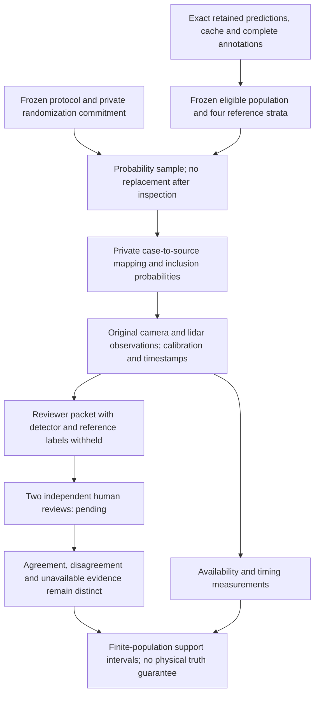

# Reference adjudication: executing the next research decision

Document ID: `reiyah.reference-adjudication-study.2026-09-07`

Version: `0.1.0`

Lifecycle status: `exploratory`

Reiyah now has an executable reference-validity experiment. It selects audit opportunities with
known probabilities, prepares sensor evidence with explicit geometry and time, withholds the
detector and reference-derived labels from reviewers, and preserves unresolved judgments in the
estimand. It does **not** yet have independent judgments or a measured physical false-positive rate.
This is the first investigation chosen in the [research-board report](RESEARCH_BOARD_2026-09-07.md).

## The scientific decision

The question is whether an unmatched detection has evidence of an object compatible with its
location. A detector can disagree with a benchmark because of reference selection, annotation
error, localization error, genuine detector error, or insufficient observation. Counting every
disagreement as a nonexistent object collapses these different explanations.

[Result AO](RESULT_AO_REFERENCE_POPULATION_AUDIT.md) demonstrated the reference-population
problem using exact retained inputs. This study must now expose which conclusions remain
defensible when the reference table is not the final judge. Nearby annotations are useful
evidence, not certification that a prediction is correct. Conversely, an absent annotation or
an empty sensor region does not certify physical nonexistence.

No model training or new driving stack is needed to answer this question. Training on these
flags before establishing their meaning risks learning the benchmark's omissions.

## Current primary work and what it changes

[FluidTest, June 2026](https://arxiv.org/html/2606.16313v1) audits proposed driving trajectories
relative to expert trajectories using semantic threats, evidence and human comparisons.
Evidence-oriented driving assessment is therefore existing related work, not a new contribution
merely because Reiyah records evidence. Its reported human study filters several ambiguous or
calibration-damaged situations and excludes uncertain answers in some analyses. Reiyah's
specific experiment must retain those states in its target quantity. FluidTest evaluates
trajectory threat, whereas this study evaluates reference-relative detection interpretation.
Human agreement in either system remains conditional on the reviewers and protocol.

[CADET v4, August 2026](https://arxiv.org/html/2606.14438v4) perturbs a frozen planner's internal
object queries and compares plan sensitivity with a kinematic relevance score. Its own study
shows how a benchmark can reward a repair that uses the same criterion as the benchmark.
That is a useful negative control for Reiyah. However, its relevance prior includes detection
confidence and predicted physical attributes. My inference is that this does not make the prior
independent of perception error. A query intervention measures a model's response; physical
causal irrelevance still requires assumptions about the scene and intervention.

[Miro and colleagues, WACV 2026](https://openaccess.thecvf.com/content/WACV2026/papers/Miro_Correcting_and_Quantifying_Systematic_Errors_in_3D_Box_Annotations_for_WACV_2026_paper.pdf)
estimate temporally consistent box trajectories from original boxes, lidar and ego poses.
They report substantial timing-related annotation errors in Argoverse 2, MAN TruckScenes and
their own data. The method assumes a planar motion model and retains box dimensions, limiting
what it can resolve. Their measurements are not measurements of nuScenes. The relevant lesson
is to bind each sensor observation to its own acquisition time and state the remaining motion
and calibration uncertainty, rather than treating a spatial threshold as self-sufficient.

These primary sources were retained privately with exact payload hashes, dates and access
records. The [source ledger](../evidence/reference-study/source-ledger-0.1.0.json) publishes
pointers and retrieval metadata only. It grants neither payload redistribution nor Gate A
scientific-evidence admission. A source's self-described novelty is not adopted as a fact.

## A design rejected before collecting labels

The first [frozen protocol, 0.1.0](../research/reference-study/0.1.0/protocol.json), sampled
30 of the 150 scenes and up to two detections per scene and reference stratum. It selected
206 cases. Before any new judgments, a precision calculation found that every group's
conservative sampling margin exceeded one. Even fully resolved judgments could not narrow
the stated confidence set. Concentration of unmatched detections in a few scenes makes
this particular worst-case bound uninformative.

The [retained calculation](../evidence/reference-study/design-0.1.0-precision-check.json)
records this failed design. This is not a theorem that all scene-sampling estimators fail.
It rejects the precision promised by this implementation and sample budget. No outcomes were
used to choose the replacement design, and the old protocol and selection remain retained.

The [superseding protocol, 0.2.0](../research/reference-study/0.2.0/protocol.json) samples
60 detections uniformly without replacement within each of four disjoint strata. Its
[freeze record](../research/reference-study/0.2.0/freeze.json) binds the protocol and the
new private randomization key before selection. Previously explored aggregate data remain
previously explored; this is prospective only with respect to independent judgments.

| Reference stratum | Eligible detections | Sample | Scenes represented |
|---|---:|---:|---:|
| Within 2 m of a retained cache annotation: control | 78,576 | 60 | 50 |
| Outside cache radius, within 2 m of a complete-table annotation | 3,151 | 60 | 36 |
| Outside both references; a full-reference-unmatched lidar detection is within 2 m | 2,351 | 60 | 29 |
| Outside both references; no such lidar coincidence | 18,930 | 60 | 45 |

The sample contains 240 detections across 93 distinct scenes. The four populations partition
103,008 score-qualified camera detections in the cache's sample population. This includes
frames excluded by AO's temporal-null eligibility rule, so the coincidence-group count is
not AO's temporal-null numerator. Group sample means cannot simply be pooled: the strata
have very different population sizes and inclusion probabilities.

This is an output-conditioned audit of detections. It cannot observe objects missed by both
systems. A later joint-miss monitor requires an opportunity population independent of the
detectors being evaluated. The present sampling design answers a narrower prerequisite.

## What the evidence packet represents



Each case requests six camera channels and the top lidar for the current, preceding and
following keyframe in its scene. Scene boundaries are explicit. Every available source file
gets a digest and format check. Missing and invalid payloads are distinct. Raw source assets
and case packets remain private; an HTML packet is a static offline research artifact, not
a new product UI or a deployment.

For a global point at the candidate reference time, the displayed sensor coordinates are

\[
p_S = R_{ES}^{T}\left(R_{GE}^{T}(p_G-t_{GE})-t_{ES}\right).
\]

Both the ego pose and calibrated sensor transform belong to that sensor observation.
Quaternions use the dataset's scalar-first `wxyz` convention. A camera projection divides
by positive optical depth; a point behind the camera cannot count as in-image. Nonidentity
rotation controls test the composition, including translations. Geometric inclusion is not
visibility: the point can still be occluded, mislocalized or physically unsupported.

Markers in adjacent frames show the same world location, not an inferred object trajectory.
The system does not silently use a missing or placeholder velocity as zero. With an assumed
speed bound \(V\), motion alone permits displacement \(V|\Delta t|\). The displayed
0, 5, 15 and 30 m/s scenarios are sensitivity calculations, not measured velocities or
calibrated uncertainty intervals. Annotation error, calibration error and lidar acquisition
times within a scan are not bounded by that calculation. Reviewers must retain ambiguity.

Full camera images remain unmodified; a separate overlay marks the candidate center. A lidar
view displays all points in a 20 m global XY neighborhood and links to the raw scan. It does
not infer empty space from absent returns. Public timestamps and scene appearance limit
blinding: reviewers must not look up the scene's annotations or receive the master mapping.

## What can be estimated

The operational outcome is support under a specified two-reviewer protocol. It is a fallible
measurement of evidence compatibility, not a directly observed physical false-positive label.
Two distinct typed reviewer IDs do not verify independent human identities. That verification
and assignment must happen outside the code before review. No generated reviewer is substituted.

Concordant support supplies \([L_i,U_i]=[1,1]\); concordant evidence of incompatibility
supplies \([0,0]\). Missing, invalid, abstained, unreviewed, unresolved or disagreeing
cases supply \([0,1]\). Reviewers must cite actual available asset hashes for a decisive
judgment. Annotation absence is not decisive evidence. A third-review resolution would be
a different protocol; it cannot silently replace disagreement in this cohort.

For group \(g\), uniform sampling gives endpoint estimates

\[
\widehat\mu_{Lg}=n_g^{-1}\sum_{i\in s_g}L_i,
\qquad \widehat\mu_{Ug}=n_g^{-1}\sum_{i\in s_g}U_i.
\]

For \(G=4\) groups and \(\alpha=0.05\), a conservative simultaneous set is

\[
\left[\max(0,\widehat\mu_{Lg}-\epsilon_g),
\min(1,\widehat\mu_{Ug}+\epsilon_g)\right],\qquad
\epsilon_g=\sqrt{\frac{\log(2G/\alpha)}{2n_g}}.
\]

Set the sampling margin to zero for a census. Hoeffding's without-replacement inequality
bounds each relevant one-sided error by \(\alpha/(2G)\); a union bound covers all four
groups simultaneously. The code tests coverage by exact hypergeometric enumeration over
every binary population total for a 100-element population sampled at size 60.

This inference uses randomized audit selection from a fixed finite population. It does not
require physical detections or scenes to be independent stochastic draws. It does require
the declared sampling design and stable potential review outcomes. It does not cover
systematic reviewer error, adaptive review rules, unseen locations or future driving.

With 60 cases per group the margin is approximately 0.205653. Even perfect resolution cannot
give narrow percentage-point precision; this is a falsification and observability pilot.
At present all judgments are absent, so every physical interpretation remains unresolved,
every group confidence set is [0, 1], and every physical-performance point estimate is null.
A wide interval is a valid result, not a reason to drop ambiguous cases.

## Execute and reproduce

Use Python with NumPy, SciPy and jsonschema; packet rendering additionally uses Pillow.
The retained selection inputs are the same four public-dataset files named by the aggregate
selection record. The private randomization key is required for exact selection replay and
must not be sent to reviewers with the source mapping.

```sh
python -B -m unittest discover -s tools/measure -p test_reference_study.py -v
python -B tools/measure/reference_study.py select --data-root /private/data \
  --protocol-dir research/reference-study/0.2.0 --key-file /private/selection-v2.key \
  --output-dir /private/new-selection
python -B tools/measure/reference_study.py prepare \
  --protocol-dir research/reference-study/0.2.0 \
  --selection /private/new-selection/selection.private.json \
  --metadata-archive /private/data/meta.tgz --output-dir /private/new-prepared-packets
python -B tools/measure/reference_study_packets.py \
  --protocol-dir research/reference-study/0.2.0 \
  --selection /private/new-selection/selection.private.json \
  --prepared-packets /private/new-prepared-packets/packets.private.json \
  --raw-root /private/raw-assets --output-dir /private/new-review-packets
```

To analyze collected reviews, pass `--reviews /private/reviews.json` into a new packet run.
The JSON array must conform to the bound review schema. Existing output directories are
refused. New revisions retain previous artifacts; a failed run's partial directory is
invalid and must not be represented as a completed packet run.

## The next lab decision

Collect the independently assigned, blinded judgments on this single frozen cohort. Resolve
whether the evidence can support the physical interpretation before fitting a better model
to these flags. If observation cannot distinguish the competing explanations, Reiyah should
represent evidence compatibility and remaining hypotheses instead of asserting a physical
error rate. If it can, freeze a new confirmation cohort before making an improvement claim.
The next research advantage must come from a result that survives this distinction.
