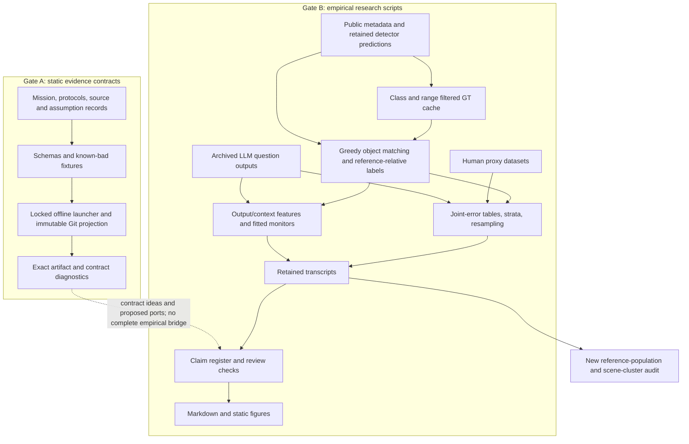
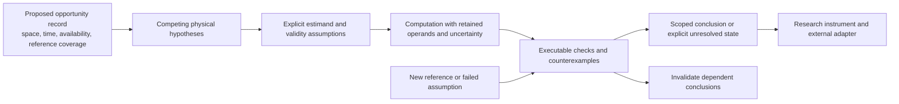

# Reiyah research-board report

Document ID: `reiyah.research-board.2026-09-07`

Version: `0.1.0`

Lifecycle status: `exploratory`

Review date: 2026-09-07. This is an evidence-based advisory investigation, not independent
institutional peer review, operator acceptance, or a safety assessment of any vendor's vehicle.

**Verdict: Reiyah is not currently a frontier perception or autonomy system. It is an ambitious
evidence architecture and an empirical measurement program, with useful descriptive findings,
substantial conventional machinery, important construct-validity gaps, and two demonstrated
validation defects. Its most credible opportunity is an evaluation system that can find and
explain invalid physical-world inferences, including its own. That opportunity is not yet a moat.**

## Scope and evidence discipline

The repository identity was resolved before investigation. The active Gate A checkout was
`74fbacc77a3c74d3a4962f488b589ee614a4c575`; the independently inspected Gate B branch was frozen at
`fd094c066437e67cefbb86f363dd1bef7ccf8e6e`. Both belong to the same Reiyah Git repository.
The active checkouts were preserved. A later parallel Gate B commit and its older 47-row replay
report were also inspected during closeout; they do not change the frozen analysis population.
The implementation accompanying this report is an isolated
research candidate based on the latter commit, not a merge into either active session.

Every tracked file in both frozen trees was inventoried and hashed: 1,141 files in Gate A and
1,030 in Gate B. Python structure was mapped; core algorithms, validators, schemas, fixtures,
experiment records, retained outputs, claims, preregistrations, custody records, diagrams,
handoffs, and accessible branch history were investigated. This is **not a claim of a formal
proof or a line-by-line semantic audit of every historical validator**. The Gate A tree contains
159,722 Python lines; enumerating those lines cannot establish their correctness.

No separate interactive UI application was found in the accessible refs. The available review
instrument consists of document/number reconciliation, an attack suite, and static figures.
An inaccessible parallel UI session is therefore not scored as though it had been inspected.
Cloud execution was unnecessary for the immediate falsification tests; no cloud training,
private-data ingestion, production change, or external communication was performed.

Read claims below using these distinctions: **observation** means inspected bytes or executed
checks; **reported result** means a retained prior transcript; **reanalysis** means a newly
executed calculation over the existing inputs; **inference** means this review's interpretation;
**proposal** means an untested research direction. Repeating a result in the same environment
is reproducibility, not independent scientific replication.

The [source ledger](../evidence/research-board-source-ledger-2026-09-07.json) records exact public
URLs, retrieved payload hashes, versions where available, and custody limits. Public report
citations are pointers; privately retained third-party payloads are not added to Git or admitted
as Gate A evidence. Corporate disclosures establish what a company reports, not independently
verified superiority. The cutoff is work accessible on the review date, not the whole future of 2026.

## 1. Reiyah in one paragraph

Reiyah currently has two related but incompletely integrated systems: a static, versioned
architecture for governing evidence about human-automation interaction, and offline analyses
of whether selected detectors, human-behavior proxies, and language models make coincident
errors on public datasets. It retains per-object matching, calculates joint-error statistics,
fits ordinary error-prediction monitors, records corrections and preregistered forecasts, and
checks consistency between artifacts. It does not presently estimate a driver's object-level
belief, maintain a learned physical world model, measure recoverability under intervention, or
establish deployable safety guarantees. Its scientific identity is **measurement and evidence
adjudication under imperfect observation**, not a new visual backbone or autonomous driver.

## 2. Architecture reconstruction

### The implemented flows

**Sensor trace.** [`build_gt_cache.py`](../tools/measure/build_gt_cache.py) constructs the
nuScenes validation population. It retains zero-lidar/radar-point objects but limits detection
classes and class-dependent range. The resulting cache has 134,565 annotation rows, 8,976
tracked instances, and 150 scenes. [`match.py`](../tools/measure/match.py) sorts predictions by
score and greedily assigns same-class objects by two-dimensional center distance, retaining the
score associated with each matched GT row. It checks aggregate mAP against a published figure.
Subsequent scripts threshold matched scores and form joint miss tables. Result L conditions on
class, range, visibility, weather and a motion label derived from a track's endpoints. Its
deepest support contains 131,722 rows. The motion label uses the complete track: legitimate for
a retrospective descriptive stratum, unavailable as such in an online prefix-only monitor.

**Ghost trace.** [`result_ah_ghost_coincidence.py`](../tools/measure/result_ah_ghost_coincidence.py)
calls detections farther than two meters from any *cached* annotation ghosts, then measures
cross-channel spatial coincidence against temporal nulls. The cache is not the full annotation
population. The new [Result AO](RESULT_AO_REFERENCE_POPULATION_AUDIT.md) demonstrates the
consequence. This branch of the analysis evaluates reference-relative unmatched predictions;
it cannot directly certify physical nonexistence.

**Monitor trace.** Sensor Result Z predicts missed counts from scene-level output features and
does not convincingly beat a density baseline under scene separation. AA predicts whether
individual reported detections match the same GT reference, comparing own-channel features
against own plus context; AD substitutes gradient boosting and records gains in some settings.
These are reference-dependent error predictors, not a sensor-fusion stack. The object monitor's
candidate population cannot contain an object that neither channel proposes.

**Human trace.** The 100-Car analyses relate looking and responding within a conflict-selected
dataset. DCPT analyzes takeover latency. BDD-A analyses compare aggregate laboratory gaze maps
with a pretrained detector or an edge-based detector. H5b defines a human miss by below-median
attention within detector-selected boxes and an automation miss by a score band. There is no
independent label for whether that human actually detected or understood that object. H6's
very weak edge detector drives the miss marginal toward saturation.

**LLM trace.** Archived per-question answers from older model families become binary failures
and majority-vote outcomes. Result V is a standardized logistic classifier with isotonic
calibration over seven output-summary features. It is not a newly learned dependence model.
Recorded within-MMLU performance is useful; benchmark transfer later fails in X2/AE. The public
archive loader lacks an exact remote revision pin, chooses among file collections, skips some
failures, and intersects available rows. That makes missingness and population drift part of
the estimand, not merely a download concern.

**Evidence trace.** The inherited Gate B replay manifest has 51 transcripts: 19 local
deterministic, 11 network-cached, 4 heavy-inference and 17 without historically recorded argv.
The checker validates digests, claim reconciliation, source custody, document coverage and
numeric consistency. Digests establish which text is present. The number-binding check can
establish that a numeral occurs in a transcript; it cannot establish that the sentence attaches
it to the correct population or causal proposition. Prior review sessions are model-assisted
internal reviews, not authenticated independent scientific review.

### What is represented, and what is absent

| Concept | Actual representation | Limit |
|---|---|---|
| Observation | Public annotation rows, predictions, gaze aggregates, event/question records | Sensor availability and annotation coverage are not consistently first-class empirical variables |
| Belief | A separate Gate A concept and schemas | No validated human or machine belief estimator on shared object-time units |
| Confidence | Detector scores, calibrated classifiers, bootstrap intervals | Scores are not physical probabilities; statistical intervals do not cover all reference error |
| Disagreement | Match/miss pairs, vote summaries, conditional associations | Missing candidates and higher-order dependence require additional structure |
| Provenance | Hashes, versions, transcripts, source/custody and claim records | Same-origin witnesses and matching bytes are not independent truth |
| Time | Keyframe timestamps, instance tracks, temporal shifts, takeover intervals | Little online state estimation; no measured clock/latency uncertainty or causal prefix discipline across the engine |
| Geometry | Global XY centers, class ranges, ego positions and estimated heading | No maintained 3D occupancy, transform covariance, object extent uncertainty or calibrated multi-view reconstruction |
| Causality | Static assumption contracts and sensitivity analyses | No demonstrated intervention effect, identified recovery policy or counterfactual driving outcome |
| Presentation | Markdown, Mermaid, static figures and numerical review checks | No inspected interactive research UI or measured effect on reviewer decisions |

The system can check internal artifact consistency and calculate reproducible statistics of
its chosen labels. It cannot prove those labels exhaust the physical world, identify beliefs
from gaze, or transfer a benchmark statistic into a safety case without additional assumptions.

## 3. Scientific thesis

The defensible current thesis is: **marginal accuracy is insufficient to characterize a
multi-channel decision system; error coincidence must be measured on a declared common
opportunity population, with absolute risk and reference validity visible.** This is valuable
but not scientifically new by itself.

The engineering thesis is stronger than a dashboard: statements about observations, inferred
states, interventions and outcomes should carry exact provenance and should fail eligibility
checks when their assumptions are unsupported. Gate A expresses this ambition. Gate B does not
yet implement it end to end.

Let binary misses be \(M_A,M_B\), with nonzero marginals \(p_A,p_B\). Then

\[
c=\frac{P(M_A=1,M_B=1)}{p_Ap_B},\qquad
c-1=\frac{\operatorname{Cov}(M_A,M_B)}{p_Ap_B}.
\]

The coefficient is a normalized association, not a causal mechanism or a universal measure of
useful diversity. Its feasible range is

\[
\frac{\max(0,p_A+p_B-1)}{p_Ap_B}\le c\le\frac{1}{\max(p_A,p_B)}.
\]

At \(p_A=.99,p_B=.5\), the entire feasible range is approximately
\([.9899,1.0101]\). A nearly blind channel forces a near-one coefficient. It does not buy
useful redundancy. When either marginal is zero, the ratio is undefined, not zero.

For stratum counts \(n_s\), the pooled conditional statistic used in the research is

\[
c_C=\frac{\sum_s n_s p_{AB,s}}{\sum_s n_s p_{A,s}p_{B,s}}
=\sum_s w_s c_s,\quad
w_s\propto n_s p_{A,s}p_{B,s}.
\]

Equal-size strata with marginals .5/.5 and joint probabilities .4 and .1 have stratum ratios
1.6 and .4, yet \(c_C=1\). Therefore a pooled value of one does not prove conditional
independence in every stratum. Also,

\[
\operatorname{Cov}(M_A,M_B)=E[\operatorname{Cov}(M_A,M_B\mid X)]
+\operatorname{Cov}(E[M_A\mid X],E[M_B\mid X]).
\]

Conditioning can remove measured difficulty mixture. Residual covariance can still be
unmeasured difficulty, common labels, selection or shared training. It is not identified
sensor physics. The proposed deeper thesis should concern **which conclusions remain
identifiable when both observers and their reference are imperfect**.

## 4. The 2026 frontier landscape

The comparisons below concern materially relevant mechanisms. Institutional reputation is
not evidence, and public company disclosures do not reveal everything a private system can do.

| Primary work and version/date | Problem and enabling insight | Assumptions and limitations | Relation to Reiyah |
|---|---|---|---|
| [RSS, arXiv v6](https://arxiv.org/html/1708.06374v6), originally 2017 | Formal driving responsibility and bounded redundant safety-critic errors; one-sided approximate independence | Error events, subsystem architecture, bounds and operating assumptions must match the theorem | Closest formal motivation. RSS explicitly permits bounded dependence; measuring detector correlation does not refute it |
| [Mobileye safety architecture](https://static.mobileye.com/website/us/corporate/files/SDS_Safety_Architecture.pdf), 2024 disclosure | Layered safety design, learned driving with independent protective mechanisms | A company architecture argument, conditional on component and system assumptions | Reiyah has neither the deployed channels nor the corresponding critic-level error population |
| [Mobileye long-tail program](https://www.mobileye.com/opinion/driving-the-long-tail/), 2026-05-27; [engineering account](https://www.mobileye.com/blog/diagnosing-the-long-tail-how-mobileye-turns-edge-cases-into-targeted-training/) | Separate failure discovery, diagnosis and targeted resolution; retrieval/generation feeds training | Diagnosis and synthetic coverage need validation; disclosures are self-reports | A replay ledger alone is behind this research loop. Reiyah could audit whether failure labels and proposed fixes are supported |
| [Tesla Q2 update](https://assets-ir.tesla.com/tesla-contents/IR/TSLA-Q2-2026-Update.pdf), 2026-07-22; [Q1 update](https://ir.tesla.com/_flysystem/s3/sec/000162828026026551/tsla-20260422-gen.pdf), 2026-04-22 | Q2 describes distilling driving behavior across camera/compute configurations; Q1 describes learned driving and inference efficiency work | No controlled public comparison against Reiyah or open full-stack specification | The frontier involves deployed temporal driving behavior and hardware constraints; Reiyah has no comparable result |
| [NVIDIA Alpamayo 2 Super technical disclosure](https://developer.nvidia.com/blog/generate-trajectories-reasoning-traces-and-auto-labels-with-nvidia-alpamayo-2-super/), August 2026 | Combine large vision-language reasoning with a trajectory-generating action expert | Reasoning traces are not verified causal explanations; synthetic and real evaluations have different validity | Reiyah should evaluate such adapters, not claim that metadata validators implement comparable perception or planning |
| [Waymo World Model](https://waymo.com/blog/2026/02/the-waymo-world-model-a-new-frontier-for-autonomous-driving-simulation/), 2026-02-06 | Generative multi-sensor driving simulation with controllable scenarios | Photorealism and conditioning do not prove interventional fidelity | Reiyah could supply paired reference/assumption audits for generated cases; it has no comparable world model |
| [EMMA](https://arxiv.org/html/2410.23262v1), 2024-10-30 | Pretrained multimodal knowledge transferred to driving tasks through unified representations | Training coverage, model cost and task metrics do not establish arbitrary driving safety | Conventional model integration is available; no reason to rebuild it before defining an independent evaluation target |
| [V-JEPA 2.1 v3](https://arxiv.org/html/2603.14482v3), 2026-06-11 | Dense spatiotemporal representations through context prediction and deep self-supervision | Representation quality is evaluated through specific probes/tasks, not exhaustive world truth | Reiyah currently has no learned temporal representation; this is a candidate frozen baseline, not proof of observability |
| [VGGT v1](https://arxiv.org/html/2503.11651v1), 2025-03-14 | Joint feed-forward estimation of cameras, depth, point maps and tracks | Learned geometric priors and input coverage still constrain correctness | Reiyah's XY matching is not competitive geometric vision; use independent geometry as an uncertain evidence source |
| [LEAD v2](https://arxiv.org/html/2512.20563v2), 2026-04-13, CVPR 2026 | Reduce learner/expert information asymmetry in end-to-end driving | Privileged expert information and simulator conditions determine what can transfer | Directly relevant to HARBOR: what the evaluator knows must not be confused with what an observer could know |
| [Beyond Simulation v1](https://arxiv.org/html/2508.01922v1), 2025-08-03 | Test world-model quality when some agents are externally controlled and when relevant agents differ from the benchmark subset | Its causal-agent definition and perturbations are scoped; observational realism metrics are insufficient | Strong precedent for evaluating the reference population and intervention interface rather than leaderboard realism alone |
| [Conformal Risk Control v4](https://arxiv.org/html/2208.02814v4), 2025-06-13; [Learn then Test v5](https://arxiv.org/html/2110.01052v5), 2022-09-29 | Select operating rules using finite-sample risk control or hypothesis testing | Bounded loss, exchangeability/iid conditions and calibration design matter; expected risk and high-probability risk are different guarantees | Gate A has eligibility concepts; Gate B's isotonic regression and ECE are not these guarantees |
| [Conformal instance-segmentation sets v1](https://arxiv.org/html/2602.10045v1), 2026-02-10 | Set-valued segmentation predictions with stated coverage targets | Query/unit definition and calibration exchangeability limit the guarantee; this is not every unseen object | A useful direction for explicit hypotheses, but cannot cure an output-selected opportunity population by itself |
| [Correlated Errors in LLMs v1](https://arxiv.org/html/2506.07962v1), 2025-06-09 | Measure correlated incorrect answers across many models and settings | Agreement conditional on error differs from Reiyah's binary joint-error ratio; observed lineage is not a randomized cause | Direct prior art. Reiyah's smaller older jury does not establish discovery of correlated LLM errors |
| [Information-theoretic ensemble selection v1](https://arxiv.org/html/2602.08003v1), February 2026 | Optimize ensemble selection using dependence rather than individual scores alone | Estimated correlation/copula structure and benchmark transfer constrain the conclusions | A relevant stronger ensemble-design comparison; a descriptive coefficient alone does not outperform it |
| [Introspective Perception](https://publications.ri.cmu.edu/storage/publications/pub_files/2016/7/root-compressed.pdf), 2016 | Predict vision-system failures from observable input context | Learned failure predictors inherit training and shift limitations | Direct predecessor to error monitoring; fitting another context classifier is not by itself novel |
| [Far3Det](https://openaccess.thecvf.com/content/WACV2023/papers/Gupta_Far3Det_Towards_Far-Field_3D_Detection_WACV_2023_paper.pdf), WACV 2023 | Study far-field detection and annotation quality beyond common evaluation ranges | Curated reference coverage remains domain-specific | Especially close to the new audit: the reference-population problem already has research history |
| [Human-AI combination meta-analysis](https://www.nature.com/articles/s41562-024-02024-1), 2024-10-28 | Evaluate whether combinations outperform standalone actors across experiments | Heterogeneous tasks and interventions prevent a universal driving conclusion | Human-machine complementarity must be tested against the strongest standalone actor on outcomes, not inferred from gaze association |

The [official NAVSIM repository](https://github.com/autonomousvision/navsim) provides a relevant
driving evaluation comparison, with its simulation assumptions made explicit. Reiyah has not run
a matched-budget comparison against that kind of planning evaluation. OpenAI, SpaceX and every
named university are not automatically relevant baselines merely because they are prestigious.
No claim here compares private unreleased systems. Searches did not identify a relevant
computer-vision/robotics publication attributable to **Erik Seidel** with sufficient confidence;
the name remains unresolved rather than being silently replaced with another researcher.

## 5. Closest related systems and research

The closest intellectual relatives are redundant-system reliability, introspective perception,
benchmark/reference auditing, selective risk control, and human-AI complementarity research.
The nearest commercial analogy is an evaluation and evidence layer integrated into another
team's perception-development loop, not an independent vehicle manufacturer.

Coincident failures were analyzed well before modern neural networks. Eckhardt and Lee's
[NASA technical report, NASA-TM-86369, 1985](https://ntrs.nasa.gov/citations/19850015006) treats
variation in input difficulty as a source of coincident software failures. Reiyah's difficulty
conditioning is in that lineage. Its added contribution could be precise common-opportunity
measurement across modern sensing interfaces, if that measurement resolves new ambiguities.

The [nuScenes detection protocol](https://www.nuscenes.org/object-detection) defines filtering
choices for both GT and predictions, including range and bicycle-rack exclusions. Those choices
are part of the benchmark estimand. Reiyah's per-object retention is useful infrastructure, but
aggregate mAP agreement does not prove identity-level equivalence to that protocol.

Standard confidence calibration is also established prior work; see
[Guo et al., ICML 2017](https://proceedings.mlr.press/v70/guo17a.html). The meaningful question
is whether Reiyah's monitor improves a declared risk/coverage tradeoff beyond properly calibrated
score and agreement baselines on independent scenarios. No new name changes that burden.

## 6. What Reiyah already does exceptionally well

No subsystem has earned an independently benchmarked claim of exceptional performance.
Three practices nevertheless deserve preservation:

- Per-object retained matches expose joint failure that an aggregate accuracy table hides.
  The independent reanalysis recovered the conditional association rather than dismissing it.
- Corrections, rejected forecasts and failed transfer remain discoverable. AJ/AN's ordering
  failures and AK's four failed numerical forecasts out of six are scientifically useful.
- Gate A carefully distinguishes artifact integrity, observation, review, acceptance and
  deployment authority. The latest contract's adversarial fixtures explicitly test generated
  approval without observed review and substitution of structurally similar identities.

The current K129 locked contract route was executed twice: both runs returned zero, ten positive
canaries passed, 81 adversarial cases were rejected, and output bytes were identical. That is
strong evidence for those tested contract behaviors. Its actual result remains
`readiness_input_seal_truth_correction_contracted_not_reviewed_not_implemented`, with operator
state `unaccepted`. A passing contract is not a repaired readiness implementation.

## 7. What is conventional

Greedy center-distance matching; score thresholds; two-by-two tables; covariance ratios;
Mantel-Haenszel statistics; stratification; clustered bootstrap intervals; logistic regression;
Poisson regression; histogram gradient boosting; isotonic calibration; group cross-validation;
label permutation; schema validation; checksums; manifests; and static dashboards are established
methods. They can be excellent choices. Their combination requires evaluation before it becomes
a methodological contribution.

None of the inspected empirical code implements an original vision foundation model, 3D
representation learner, occupancy estimator, tracker, multimodal fusion network, causal world
model or planner. These omissions are acceptable for an evidence tool, but incompatible with
describing the present repository as a frontier implementation of those capabilities.

## 8. What is weak or scientifically unproven

**Reference validity is the immediate weakness.** In the independently executed audit, 3,151
of 24,432 camera predictions flagged as ghosts were within two meters of annotations excluded
from the cache; the lidar figures were 5,728 of 23,840. These are approximately 12.9% and 24.0%.
This does not certify each prediction's physical correctness. It proves the cache-based absence
predicate differs materially from the fuller annotation-based predicate.

The demonstrated defect is specifically in the ghost series' claimed reference coverage and
physical interpretation. It does **not** invalidate the miss coefficients calculated on their
declared filtered population, nor erase the separate denominator comparisons already retained.
The user supplied a concurrent Claude review acknowledging the reference mismatch and emphasizing
this scope distinction. That review is useful criticism, not independent verification of AO:
its numerical statements rely on this reanalysis. Its suggestion that the changed flags are
necessarily non-phantoms is stronger than proximity alone establishes.

**The strongest remaining descriptive association survives.** At score .30 the conditional
ratio is 1.151053. Resampling whole scenes gives a percentile interval [1.128749, 1.166206],
wider than the retained instance-bootstrap interval [1.138, 1.160]. The support remains the
original fixed deepest-stratum support. Nearby scenes may share geography; this is not a claim
of universal iid sampling or calibrated coverage under all dependence structures.

**The temporal null is consequential.** On fuller annotations and fixed heading-eligible donor
support, the unmatched-detection enrichment is 6.893878 under ego-relative relocation and
4.341902 under world-fixed comparison. These are different null hypotheses, not interchangeable
estimators of one physical parameter. More reference annotations reduced both numerator and
denominator; the ratio did not necessarily decrease. Therefore an earlier ratio cannot simply
be called an upper bound because its labels contain unknown contamination.

A momentary unmatched detection is also not a lower bound on hallucination: an unannotated
physical object can move or leave a geometric tolerance between frames. Persistence controls
selected from the same incomplete reference do not identify that missing physical population.

**Two actual fail-open defects were reproduced.** The original matcher printed failed mAP
validation yet returned zero and wrote an output. The original replay consumer accepted a
producer that emitted the expected transcript and exited 17 as replicated. Fixes and executable
regressions accompany this report. The clean original Gate B digest check also passed; passing
its ordinary suite did not expose either defect.

**Result O overstates the sensitivity bound.** Under the standard bounding-factor setup,
\(BF=ab/(a+b-1)\). For an observed risk ratio 1.8, the equal-strength threshold is 3, yet
\(a=2,b=9\) gives \(BF=1.8\). An arm below 3 can therefore coexist with sufficient confounding.
The threshold constrains the maximum/equal-strength benchmark, not a requirement that each arm
individually exceed it. This follows the primary
[Ding-VanderWeele sensitivity analysis](https://arxiv.org/abs/1507.03984).
Its application also needs a justified target risk ratio and confounding model; it does not
identify a causal effect of one detector's failure on another's.

**The monitors face weaker baselines than the rhetoric suggests.** A learned correctness
classifier is compared with raw agreement or counts in several results. Matched calibration,
model-identity-aware stacking, own-score calibration and scene-grouped tuning are required.
AA's outer split uses scenes; inner isotonic fitting via ordinary `cv=5` does not preserve that
grouping. AD's comparison with fold spread is not a paired uncertainty analysis. These are
evaluation limitations, not proof that the monitor has no useful signal.

**Human belief and recovery are unmeasured.** Gaze allocation, response occurrence, takeover
latency, hazard detection, comprehension and recoverability are different constructs. A
laboratory gaze aggregate is not the particular driver's state. The primary
[BDD-A paper](https://arxiv.org/pdf/1711.06406v3) describes the attention data collection; it does
not license equating every below-median box with a missed object. Both-channel absence is also
not a joint *silent* miss without independently defined notification and awareness states.

## 9. Potentially novel contributions

| Type | Present assessment | Evidence needed to earn a stronger claim |
|---|---|---|
| Implementation novelty | Project-specific integrations and retained per-object analysis | Reusable external integrations with measured correctness and cost |
| Architectural novelty | Unusually explicit evidence/authority distinctions; no established unique architecture | Comparison with existing assurance, experiment-tracking and provenance systems on failures they cannot express |
| Methodological novelty | Possible future reference-aware partial identification and executable claim obligations | A method or theorem that changes valid inferences, plus discriminating benchmarks |
| Scientific novelty | No demonstrated new general law, representation or identifiability result | A falsifiable result that survives relevant prior art, independent replication and alternate reference construction |
| Product novelty | A coherent operator-facing evidence instrument is plausible | External users making better decisions with less effort; no validated user study presently |

The best candidate is a system that propagates **reference uncertainty and observation
availability into the admissible conclusion**, instead of attaching provenance after a point
estimate has already been accepted. Existing probabilistic inference and formal evidence systems
are substantial prior art. Combining them is a hypothesis about utility, not a novelty certificate.

## 10. Major hidden assumptions

1. **Common opportunity:** both channels are evaluated on the same physically relevant population.
   Output-selected boxes and filtered GT caches violate easy versions of this assumption.
2. **Reference sufficiency:** absence from an annotation subset means absence in the world.
   AO falsifies the subset equivalence and leaves physical truth unresolved.
3. **Match identity:** approximate aggregate mAP agreement authenticates individual assignments.
   Greedy ties, filters and coordinate conventions can change which objects jointly fail.
4. **Sample independence:** instances are sufficiently independent for reported intervals.
   A scene-level perturbation affects many tracks simultaneously.
5. **Useful ratio comparability:** coefficients across different marginal regimes mean the same
   thing. The Frechet bound and Result P refute that shortcut.
6. **Proxy validity:** gaze or reaction time identifies latent object belief or recovery capacity.
   Neither implication is established by the present data.
7. **Causal conditioning:** residual dependence after a few measured covariates identifies shared
   sensing physics. Hidden common causes and reference errors remain possible.
8. **Temporal null validity:** relocated donor detections preserve all nuisance structure except
   the shared failure mechanism. Ego-relative and world-fixed structure are different nuisances.
9. **Transfer:** the same algebra across sensors, human proxies and LLM questions identifies the
   same scientific mechanism. Algebraic portability does not imply construct equivalence.
10. **Evidence closure:** correct bytes and internal reviews imply a sound claim. The false-pass
    probes and E-value counterexample demonstrate why semantic review remains necessary.

## 11. Failure modes

| Failure mode | Observable consequence | Appropriate response |
|---|---|---|
| Missing source row treated as empty detections | Fabricated misses or null donors | Explicit unavailable state and input-coverage checks |
| Filtered reference presented as exhaustive | Correct or ambiguous objects called ghosts | Coverage-aware reference, retained annotation IDs, independent adjudication |
| Shared calibration/frame error | Correlated geometric mismatches | Transform/time error sensitivity, alternate matching, frame provenance |
| Shared occlusion or range difficulty | Both channels fail without disagreement | Evaluate risk of jointly missing opportunities, not only proposed objects |
| Nearly blind channel | Coefficient near one looks reassuring | Report absolute joint loss, marginals and feasible bounds |
| Scene leakage or ungrouped calibration | Optimistic accuracy/calibration | Nested scene/time/site-separated fitting and paired comparisons |
| Benchmark/source selection | Apparent transfer from a selected common subset | Missingness ledger, immutable source revisions and gold agreement checks |
| Wrong spatial null | Large ratio interpreted as unique shared hallucination | Multiple preregistered nulls with matched support and interpretable nuisance preservation |
| Post-intervention observation treated as pre-decision evidence | Spurious monitor foresight or causal story | Event time plus availability time and enforced causal prefixes |
| Unanimous models share a mistake | Confident ensemble error | Calibrated risk and independent evidence; more votes alone are insufficient |
| Higher-order dependence hidden by pairs | Fusion error underestimated | Evaluate the actual fusion rule and multi-channel joint distribution |
| Review generator and checker share assumptions | Consistent but false report | Alternate implementations, independent reference construction and adversarial semantic witnesses |

A concrete higher-order counterexample is the uniform distribution over failure states
001, 010, 100 and 111. Every pair is independent, but all three fail with probability .25,
twice the independent .125. Pairwise statistics are insufficient for an arbitrary fusion rule.
This does not invalidate RSS's particular union-bound construction; it blocks transferring pair
statistics into unrelated ensemble guarantees.

Similarly, `log(all_fail_probability) / log(mean_marginal_failure)` is not a literal count of
independent channels. Two genuinely independent channels with failure rates .1 and .9 produce
about 3.474 by that formula. Preserve it, if useful, as a declared homogeneous-equivalent
summary with its assumptions, not an identified number of independent sensors.

## 12. State-of-the-art scorecard

These are judgments of the demonstrated capability against relevant public work, not numerical
leaderboard rankings. Absent capabilities are labeled behind relative to the user's proposed
full autonomy scope; an evidence tool need not implement all of them.
The architecture explicitly disclaims being an autonomy stack. An absent subsystem is not evidence
that its authors falsely claimed to have implemented it; the scorecard answers the requested broad
frontier comparison while judging the measurement program separately.

| Subsystem | Classification | Reason |
|---|---|---|
| Original visual representation and detection | **BEHIND** | No original modern perception model; empirical comparisons use older released detectors |
| Learned/classical 3D reconstruction and occupancy | **BEHIND** | Center matching does not implement scene reconstruction or occupancy reasoning |
| Temporal state estimation and tracking | **BEHIND** | Reuses dataset tracks and shifts; no demonstrated online belief state or occlusion recovery |
| Operational sensor fusion/planning interface | **BEHIND** | No evaluated fusion policy or planner-facing physical risk interface |
| Descriptive joint-error measurement | **STRONG** within its narrow research scope | Retained identities, conditioning, negative findings and multiple comparisons; mathematical method is standard and reference defects remain |
| Physical ghost identification | **BEHIND** | Reference-relative absence is unadjudicated; selected reference exclusions materially change labels |
| Output-based error monitoring | **STANDARD** | Conventional fitted classifiers; no compelling matched-baseline transfer or selective-risk advantage |
| Uncertainty and calibration | **STANDARD** | Bootstrap and isotonic tools; no demonstrated robust conditional/sequential guarantee |
| Human belief/readiness/recoverability | **BEHIND** | Proxy analyses do not validate these latent constructs |
| Causal policy evaluation | **BEHIND** | Static assumption contracts and associations, no identified policy-effect study |
| Evidence-contract design | **STRONG** as a design | Explicit authority/custody boundaries and adversarial fixtures; complexity and incomplete empirical integration limit the conclusion |
| Empirical replay consumer | **STANDARD**, with demonstrated defects repaired here | Ordinary digest checks originally accepted failed producers; new regressions cover that path |
| Dataset/reference science | **STANDARD**, with a useful new audit | Public datasets, no exclusive reference advantage; AO improves internal validity without establishing new prior art |
| Research review instrument | **STANDARD** | Numeric/claim reconciliation, static displays; no inspected interactive instrument or reviewer-outcome experiment |
| End-to-end scientific/system performance | **BEHIND** the requested frontier standard | No externally replicated decision advantage, robust deployment result, or validated new physical-world inference |

No subsystem is classified **FRONTIER** or **NOVEL-FRONTIER** on present evidence.

## 13. The ten hardest unanswered questions

1. **What is the opportunity space when every observer misses an object?** If opportunities are
   detector outputs, joint absence is structurally unmeasurable. What independent reference
   reveals those opportunities, and where is that reference also blind?
2. **Which claims are identifiable from the available evidence?** If two worlds generate the
   same sensor/output history but one contains an occluded obstacle, no deterministic function
   of that history can always distinguish them. Which assumptions or additional measurements
   reduce that equivalence class?
3. **How much observed channel dependence is dependence of the labeling mechanism?** Alternate
   references, matching rules and annotator information can change both channels' labels together.
4. **What survives when temporal features use only information actually available before the
   decision?** Complete tracks and future annotations can create retrospective foresight.
5. **Can we distinguish unknown from safe at useful coverage?** A system that abstains everywhere
   is truthful but useless; one that never abstains hides non-identifiability.
6. **Does the monitor improve an actual decision after strong calibration baselines?** Does an
   operator or policy benefit, or does AUC merely recover difficulty and score information?
7. **Is purported diversity more than marginal performance and selection arithmetic?** Would the
   result persist at matched loss, costs, thresholds and opportunity populations?
8. **Can human object belief be measured without changing it through the measurement?** A query,
   alert or experimenter's timing is itself an intervention with possible behavioral effects.
9. **What evidence would force an internal interpretation to be withdrawn automatically?** Can
   invalidated calibration, reference coverage or causal assumptions propagate to every dependent claim?
10. **What is the smallest independently checkable unit of physical evidence?** A file hash is
    too weak; a fully specified world is impossible. Could a bounded spatiotemporal opportunity,
    observer availability, competing hypotheses and explicit proof obligations be sufficient?

Either answer to question three is useful: persistent dependence under alternate references
strengthens a physical/model explanation; disappearance reveals a benchmark-construction problem
that the field should measure explicitly.

## 14. The five experiments with highest expected information gain

All numerical go/no-go margins below are **proposed design thresholds**, not observed effects or
preregistered commitments. Freeze the analysis, power calculation, exclusion policy and stopping
rule before examining new test labels. Rank follows the dependencies of valid inference.

### Investigation 1: Does the reference create the phenomenon?

**QUESTION.** How much of cross-channel unmatched-detection coincidence is induced by the
reference population and null construction?

**HYPOTHESIS.** Some reported ghost labels come from excluded annotations; after correction,
a residual spatial association may remain but will not by itself establish shared hallucination.

**WHY NOW.** Every physical interpretation downstream depends on this answer, and it is testable
with retained inputs before buying compute. AO has already answered the subset part positively.

**EXPERIMENT.** Freeze existing inputs. Compare filtered and complete annotation references,
hold temporal donor eligibility independent of donor detection count, and contrast ego-relative
with world-fixed nulls. Then independently adjudicate a scene-stratified sample of coincident
and noncoincident unmatched predictions, blinded to model identity and the hypothesis. Retain
ambiguous cases, reference visibility limits and adjudicator disagreement. Power the annotation
stage to distinguish the preregistered material contamination rate, accounting for scene clustering.

**BASELINES.** Historical AH; complete-annotation proximity; official protocol-aligned matching;
a reference-only audit without a learned model; suitable curated far-field references where available.

**ABLATIONS.** Class exclusion, range exclusion, center versus extent geometry, threshold,
donor support, temporal offset, transport convention, scene/site resampling and reference source.

**METRICS.** Label transitions and unresolved fraction; joint coincidence counts and denominators;
scene-cluster intervals; stability across references; physical adjudication precision; review cost.

**FAILURE CRITERION.** A physical ghost claim fails if plausible reference constructions or blinded
adjudication account for it, or leave the relevant objects unresolved. The claim already fails
if it treats filtered-cache absence as exhaustive annotation absence.

**SUCCESS CRITERION.** A residual effect with independently adjudicated cases, stable interpretation
across justified nulls, and explicit unresolved mass. A finding that the reference created the
effect is also scientifically successful falsification, though it defeats the original claim.

**SECOND-ORDER CONSEQUENCE.** If reference error dominates, make reference validity the program's
first product primitive. If residual physical errors remain, use those cases to test observer
observability and temporal warning rather than expanding the detector roster.

### Investigation 2: Can available temporal evidence predict a joint miss usefully?

**QUESTION.** Does an output/history monitor detect risk of joint failure on independently
defined opportunities before an actionable decision time?

**HYPOTHESIS.** Temporal contradiction and observer availability add information beyond calibrated
scores, agreement, model identity and scene difficulty, but only on an identifiable subset.

**WHY NOW.** This separates a useful perception-evidence primitive from a retrospective correlation
report. It also prevents a large representation investment before a simple baseline answers the question.

**EXPERIMENT.** Use reference-audited episodes with frozen, causal input prefixes. Split by scene,
route/site and later recording period. Reserve untouched calibration and test episodes. Start
with lightweight monitors; add a frozen temporal representation only if residual errors justify it.
Evaluate warning rules at fixed false-alarm and abstention budgets with matched compute.

**BASELINES.** Calibrated own-score, calibrated agreement, density/context-only predictor,
model-identity-aware logistic stacking, gradient boosting, and a conventional temporal consistency
monitor. Give every baseline the same permissible inputs and tuning/calibration budget.

**ABLATIONS.** Remove history, shuffle time within valid groups, remove cross-channel features,
remove availability indicators, vary reference coverage and remove complete-track information.

**METRICS.** Joint-miss recall at fixed false alarms per scene/time, warning lead time, selective
risk/coverage, proper scoring loss, worst-group risk and p95 latency/memory. AUC is secondary.

**FAILURE CRITERION.** No paired improvement over the strongest calibrated baseline; benefit
vanishes under prefix enforcement or site separation; or abstention removes useful coverage.

**SUCCESS CRITERION.** As a proposed go/no-go target, at least 20% relative reduction in missed
hazard episodes at the same false-alarm and coverage budget, with paired uncertainty excluding
no improvement, replicated on another dataset/model family. The loss and margin need application
justification before preregistration; this is not a present performance claim.

**SECOND-ORDER CONSEQUENCE.** Success motivates a richer temporal evidence representation.
Failure favors a compact evaluation/reference tool over a new perception architecture.

### Investigation 3: Is the human construct measurable and useful?

**QUESTION.** Can an object-specific human belief measure predict recoverable decisions beyond
gaze, reaction time and the best standalone automation?

**HYPOTHESIS.** Gaze and takeover latency are insufficient; carefully separated detection,
comprehension and action probes may explain distinct components of performance.

**WHY NOW.** Human-automation readiness is the founding mission. Continuing to optimize proxy
correlations without construct validation risks months of scientifically irrelevant work.

**EXPERIMENT.** First implement an offline protocol and measurement model. A subsequent authorized
participant study uses controlled video/simulator episodes, object-specific probes and randomized
information interventions, with probe timing as an explicit factor. Separate participant/session
splits, measure probe-induced changes and preserve unobservable states. Public gaze data alone
cannot supply the missing belief labels. Participant collection is not part of this implementation.

**BASELINES.** Gaze-only, takeover latency, self-report confidence, automation-only, human-only,
and a fixed assistance policy; compare against the strongest standalone actor.

**ABLATIONS.** Probe versus no probe, information versus sham information, gaze availability,
hazard visibility, object ambiguity, workload and intervention timing.

**METRICS.** Construct reliability, discriminant validity, proper belief scoring, actionable decision
loss, missed hazards, recovery time distribution, subgroup effects and measurement reactivity.

**FAILURE CRITERION.** The proposed belief variable adds no held-out predictive value, changes the
state it claims to measure substantially, or the combined policy fails to improve the best actor.

**SUCCESS CRITERION.** A stable measurement model separates constructs and an explicitly randomized
information intervention changes the predicted decision mechanism on held-out participants.

**SECOND-ORDER CONSEQUENCE.** Success restores a justified HARBOR-specific trajectory. Failure
requires narrowing the mission to machine-observer evidence, rather than relabeling gaze as belief.

### Investigation 4: What actually causes dependence?

**QUESTION.** Is observed dependence driven by sensing modality, model lineage, shared training,
physical ambiguity, marginal performance, or the reference?

**HYPOTHESIS.** Several mechanisms coexist; a same-kind versus different-kind rule is insufficient.

**WHY NOW.** Mechanism determines how to reduce errors. Ranking two lidar models above a weak
camera pair cannot identify a modality intervention.

**EXPERIMENT.** After reference validation, construct a factorial comparison across at least two
architectures and training-data lineages per feasible modality, with multiple seeds or independent
released systems. Match operating loss and compute budgets. Apply controlled sensor/geometry
corruptions and separately intervene on reference/matching. Restrict causal conclusions to
the interventions actually randomized or controlled.

**BASELINES.** Marginal-only independent prediction, difficulty-mixture models, calibrated stacking,
matched-performance ensembles and an explicit shared-reference-error model.

**ABLATIONS.** Shared versus independent training, modality, architecture, matched versus unmatched
marginals, reference source, spatial calibration, occlusion and synchronization.

**METRICS.** Absolute joint loss, stratum dependence, fusion-rule loss, higher-order moments,
intervention effects and uncertainty over scenes and model instances.

**FAILURE CRITERION.** Claimed modality or lineage effects disappear after matching marginals or
changing the reference, or fail under the controlled intervention intended to express that mechanism.

**SUCCESS CRITERION.** An intervention predictably removes a specific shared-failure component
without buying the effect through poorer marginals or extra compute. That would be more useful
than another large coefficient.

**SECOND-ORDER CONSEQUENCE.** Design complementary sensing/training around the identified mechanism;
otherwise abandon the categorical independence story and retain only conditional descriptions.

### Investigation 5: Can the evidence contract survive transfer and changing validity?

**QUESTION.** Can a monitor and its evidence obligations transfer while exposing when their
calibration or reference assumptions stop being supportable?

**HYPOTHESIS.** A bounded set-valued risk/abstention interface can transfer with a small explicit
target-label budget better than a fixed universal correctness score.

**WHY NOW.** Existing cross-benchmark LLM transfer failures directly challenge the universal-monitor
story. Deployment requires identifying invalid guarantees, not just reducing average ECE.

**EXPERIMENT.** Freeze the source monitor and decision rule. Test new sites, sensors/models and
reference regimes with target-label budgets of zero and several preregistered increasing sizes.
Add known shifts, unknown shifts and unchanged negative controls. If using finite-sample risk
control, state whether the claim is expected risk, high-probability risk, marginal coverage or a
time-uniform guarantee, and test only within the corresponding sampling assumptions.

**BASELINES.** Unadapted and recalibrated score/stacking monitors, target-only calibration,
standard conformal/risk-control procedures, and simple shift alarms at matched alert budgets.

**ABLATIONS.** Target labels, grouping, reference-coverage information, model identity, temporal
history and automatic invalidation of dependent claims.

**METRICS.** Risk/coverage curves, worst-group loss, calibration error with uncertainty, label
efficiency, false shift alarms, detection delay and frequency of unsupported accepted claims.

**FAILURE CRITERION.** Advantages require extensive target labels, disappear against equally
calibrated baselines, or the system continues asserting a guarantee outside its assumptions.

**SUCCESS CRITERION.** On multiple held-out shifts, improve useful coverage at the same justified
risk target and label budget, while reliably invalidating unsupported claims. No distribution-free
claim is permitted for arbitrary unseen adversarial shifts.

**SECOND-ORDER CONSEQUENCE.** Success supports an adapter-independent evidence interface. Failure
supports task-specific monitors and a narrower reference-audit product.

## 15. Architecture changes I would make

**A redesign is warranted at the empirical representation boundary.** Preserve released records
and tested behavior, but stop letting a scalar coefficient, a GT row index or an output box act as
the system's universal scientific object.

Make a spatiotemporal **opportunity record** first-class: independently declared population,
stable episode/object identity where identifiable, coordinate frame and transforms, observer
availability, event time, availability time, reference coverage, candidate hypotheses and reasons
for unresolved status. Separate the reference builder, matcher, estimand, calibration procedure,
decision rule and renderer. Each should declare its inputs and assumptions rather than import
another script's mutable globals or monkeypatch its estimator.

This is a proposed offline research architecture, not an authorized control runtime.

Represent an observer's epistemic uncertainty separately from physical ambiguity and missing
inputs. A posterior over hypotheses is appropriate only when its likelihood/prior assumptions
are justified; otherwise retain a set of compatible hypotheses or bounds. Reference labels
should carry coverage and adjudication provenance, not inherit truth from a filename containing GT.

Shrink the trusted core over time. Gate A's repeated large validators create a review and
maintenance bottleneck at tenfold complexity. Consolidate future releases around a small typed
semantic kernel and explicit versioned adapters, with differential tests against independent
implementations. Do not rewrite the released validator lineage during a concurrent engine session.
Likewise, stop proliferating lettered experiments by importing and overriding earlier scripts.
Use a parameterized, immutable experiment specification with an explicit estimand and input closure.

## 16. Capabilities I would add

Add reference-coverage and missing-input audits; causal-prefix checks; alternate-reference and
alternate-matcher replay; scene/site-aware calibration and resampling; explicit feasible bounds
for dependence statistics; and a semantic link from claim to exact operands, population and
assumptions. The new AO tool supplies the first bounded part of this expansion.

For the research UI, make a reviewer able to select a claim and inspect its opportunity set,
excluded observations, numerator/denominator, alternative reference, uncertainty and falsifying
cases. A reference toggle should expose that it changes the estimand. Evaluate the instrument
with seeded scientific defects, measuring reviewer detection, false accusations, time and
agreement. A visually compelling scene without that path is not an evidence instrument.

## 17. Capabilities I would explicitly NOT add

I would not now train a vision foundation model, build a driving planner, connect vehicle
controls, launch a broad cloud detector sweep, add autonomous publication, or add more model
reviewer personas. I would not build a photorealistic world-model demonstration before a valid
measurement question exists. I would not use a new multimodal model as unexamined ground truth.
None resolves the current reference and construct uncertainty efficiently.

## 18. Research directions worth abandoning

Abandon the universal rule that different kinds of channels buy independence. Retain the
measured, population-specific comparisons and their falsifications. Abandon treating normalized
coincidence as absolute safety or a literal count of independent observers. Abandon safety-evidence
budget conversion from detector-level ratios without the theorem's matching event definitions.

Abandon gaze-threshold association as proof of human-machine complementary detection. Abandon
changing a classifier and calling it a new dependence architecture. Abandon adding more assurance
paperwork that cannot distinguish a known false empirical claim from a true one.

## 19. Research directions worth doubling down on

Double down on independently defined opportunities, preserving negative results, reference
validity, causal time boundaries, and experiments that compare competing explanations. The
strongest asset is the possibility of retaining enough evidence to discover that one's own
conclusion was wrong and then localize why. AO is an example, not yet a general system.

Preserve the sensor finding as a bounded descriptive result. It survived a more appropriate
scene-cluster reanalysis. Use that stability as a starting point for reference/mechanism tests,
not a license to generalize across humans, language models and vehicle safety critics.

## 20. What the strongest Mobileye/Tesla/Stanford reviewer would attack

These are anticipated objections, not statements made by those organizations.

| Reviewer perspective | Most damaging objection |
|---|---|
| CVPR/ICCV/ECCV | Where is the new method, matched modern baseline, independent test domain, ablation and decision-relevant effect? |
| Mobileye perception/safety | Your measured variables are not our safety-critic events. RSS already allows bounded dependence. Where are geometry validity and exact fusion semantics? |
| Tesla autonomy architecture | How does this improve closed-loop behavior, tail failures or the data-engine loop at fixed latency and compute? Your old detectors and retrospective labels do not answer that |
| Robotics scientist | What is observable? Which state variables are identified? How do timestamp, geometry, occlusion and intervention change the inference? |
| Safety-critical systems researcher | Why did a failed process become replicated evidence? Which trusted components could manufacture mutually consistent false conclusions? |
| Human-factors scientist | Why should gaze, acting and takeover time measure the same latent construct? Where is the strongest standalone-actor comparison? |
| Skeptical founder | What prevents a capable customer from implementing these tables and classifiers internally in weeks? Where does exclusive or compounding data value arise? |

The honest answer is that several objections currently succeed. The next program should be
designed to let them succeed quickly if its central idea is wrong.

## 21. What result would make that same reviewer pay attention

An independently reproduced demonstration that **existing evaluation pipelines accept a
materially wrong physical-world conclusion, while Reiyah identifies the missing evidence,
provides a replayable counterexample, and supports a better decision at matched cost** would
deserve attention. To become more than an audit feature, it must work across independently
built models and references and then improve calibrated decisions on held-out temporal episodes.

The compelling artifact would combine a reference-audited episode dataset, immutable model/input
versions, strong calibrated baselines, an observer-independent opportunity space, explicit
unknowns, and executable witnesses explaining why each conclusion is or is not supported.
Independent researchers should be able to substitute their model and reproduce the finding.

The proof has two layers: deterministic obligations about operands, coverage, time and
derivations; and statistical evidence about performance under stated sampling assumptions.
Neither layer proves the entire physical world. A true advance would make this distinction
operationally useful rather than merely documenting it.

## 22. Verdict on whether Reiyah is currently frontier

**No.** The available evidence does not support frontier-level perception, geometric reasoning,
human belief estimation, causal policy evaluation or end-to-end autonomy. No subsystem presently
earns novel-frontier status. Some evidence-contract design and research practices are strong.
The narrow detector association is reproducible. Those facts do not close the scientific gap.

The largest risk is overclaiming a general discovery from conventional statistics and imperfect
proxies. The largest technical opportunity is turning the repository's concern for evidence
into a system that demonstrably detects invalid measurement and improves decisions.

## 23. Verdict on whether Reiyah could become category-defining

**Plausible as an evidence/evaluation infrastructure hypothesis; not demonstrated as a company
thesis.** There is currently no established exclusive dataset, hard-to-reproduce algorithm,
deployment advantage, independently validated performance lead or customer integration moat.
The present statistics are reproducible by competent internal teams.

| Condition | Current evidence | What must become true |
|---|---|---|
| Technical differentiation | Artifact discipline and scoped analysis | Find important invalid inferences that strong existing pipelines miss |
| Data advantage | Public datasets and retained outputs | Accumulate legally usable, independently adjudicated ambiguity/failure episodes with difficult reference coverage |
| Compounding research value | Corrections and historical experiments | Each integration adds reusable reference tests, failure mechanisms and stronger calibration evidence |
| Integration depth | Script/file interfaces | Stable adapters used in model evaluation and release decisions with low operational burden |
| Deployability | Offline program | Predictable cost/latency and useful uncertainty behavior on real partner workloads |
| Defensibility | No established moat | Unique reference expertise/data plus trusted interoperability; report generation alone is easy to copy |
| Strategic importance | Reliability is a material problem | Demonstrable prevention of expensive wrong engineering decisions, followed by measured risk/coverage gains |

Independence as a company is compatible with this path. Acquisition interest, valuation and
executive enthusiasm are not technical evidence and cannot be inferred from this repository.

## 24. The shortest credible path

1. **Finish reference validity first.** AO supplies reproducible subset and null-sensitivity
   evidence. Next adjudicate the cases necessary to distinguish annotation absence from physical
   nonexistence. Stop using physical ghost terminology for unresolved cases.
2. **Run one hard temporal monitor comparison.** Use validated opportunities, causal prefixes,
   scene/site separation and equally calibrated baselines. Define the decision loss before training.
3. **Replicate externally on another model/reference domain.** If gains fail to transfer, retain
   a narrower auditing tool; do not claim universal perception evidence.
4. **Integrate the minimum general representation that these results require.** The first
   external integration must reproduce a concrete invalid inference and a better decision,
   not merely populate a dashboard.

No credible duration estimate is possible without the independent annotation and integration
workload. The path is short in dependency count, not a promise that the difficult science is quick.
Large cloud experiments should wait until their outcomes discriminate between these hypotheses.

## 25. The single most important thing to do next

**Establish whether the reference can support the physical conclusion.** Begin with the
cross-channel unmatched-detection claim because it is measurable now, scientifically consequential,
and exposes the difference between an evidence system and a correlation dashboard. Do not add
another detector until the opportunity and reference populations have been resolved.

## IF THIS WERE MY LAB

I would choose **one reference-validity study**, with a stop rule that permits the original
physical ghost interpretation to fail. I would assign the available compute to replay and
alternate-reference checks, then spend the scarce scientific effort on independent adjudication
of the uncertain cases. This has greater information value than a larger model or another
demonstration because every later claim depends on it.

That investigation has begun here. Result AO independently reconstructs the conditional sensor
association, changes the bootstrap unit to scenes, exposes excluded-reference ghost flags, and
compares temporal nulls while retaining exact input hashes. Regression tests reproduce and
reject the two failed-process pathways. The audit can retain annotation tokens privately for follow-up
adjudication and refuses missing prediction samples as unavailable inputs.

The immediate conclusion is neither that all prior work is invalid nor that Reiyah has found a
new law. It is that a material reference error existed, a narrower association survives, and the
physical interpretation remains unresolved. I would stake the next phase of the lab on resolving
that uncertainty honestly. If Reiyah cannot defend its own measurements, it has no basis for
becoming the system others trust to defend theirs.
